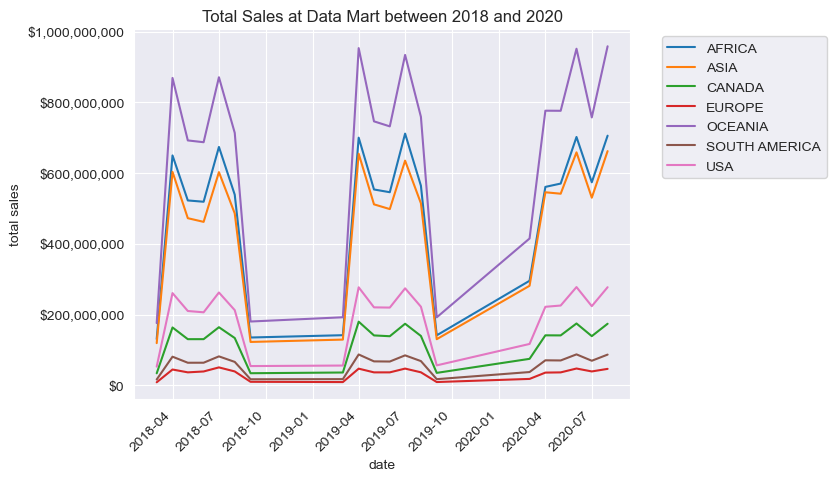

# Case Study #5: Data Mart
The case study questions presented here are created by [**Data With Danny**](https://linktr.ee/datawithdanny). They are part of the [**8 Week SQL Challenge**](https://8weeksqlchallenge.com/).

My SQL queries are written in the `PostgreSQL 15` dialect, integrated into `Jupyter Notebook`, which allows us to instantly view the query results and document the queries.

For more details about the **Case Study #5**, click [**here**](https://8weeksqlchallenge.com/case-study-5/).

## Table of Contents

### [1. Importing Libraries](#Import)

### [2. Tables of the Database](#Tables)

### [3. Case Study Questions](#CaseStudyQuestions)

- [A. Data Cleansing](#A)
- [B. Data Exploration](#B)
- [C. Before & After Analysis](#C)
- [D. Bonus Question](#D)

<a id = 'Import'></a>
## 1. Importing Required Libraries


```python
import psycopg2 as pg2
import pandas as pd
from datetime import datetime
import seaborn as sns
import matplotlib.pyplot as plt
import matplotlib.ticker as ticker
import os
import warnings

warnings.filterwarnings('ignore')
```

### Connecting PostgreSQL database from Jupyter Notebook


```python
# Get PostgreSQL password
mypassword = os.getenv('POSTGRESQL_PASSWORD')

# Connecting to database
conn = pg2.connect(user = 'postgres', password = mypassword, database = 'data_mart')
cursor = conn.cursor()
```


<a id = 'Tables'></a>
## 2. Tables of the Database


```python
cursor.execute("""
SELECT table_schema, table_name
FROM information_schema.tables
WHERE table_schema = 'data_mart'
"""
)

print('--- Tables within "data_mart" database --- ')
for table in cursor:
    print(table[1])
```

    --- Tables within "data_mart" database --- 
    weekly_sales
    

Here is the `weekly_sales` table, containing 17,117 data since the March 26, 2018


```python
pd.read_sql("""
SELECT *
FROM data_mart.weekly_sales;
""", conn)
```

<table border="1" class="dataframe">
  <thead>
    <tr style="text-align: right;">
      <th></th>
      <th>week_date</th>
      <th>region</th>
      <th>platform</th>
      <th>segment</th>
      <th>customer_type</th>
      <th>transactions</th>
      <th>sales</th>
    </tr>
  </thead>
  <tbody>
    <tr>
      <th>0</th>
      <td>31/8/20</td>
      <td>ASIA</td>
      <td>Retail</td>
      <td>C3</td>
      <td>New</td>
      <td>120631</td>
      <td>3656163</td>
    </tr>
    <tr>
      <th>1</th>
      <td>31/8/20</td>
      <td>ASIA</td>
      <td>Retail</td>
      <td>F1</td>
      <td>New</td>
      <td>31574</td>
      <td>996575</td>
    </tr>
    <tr>
      <th>2</th>
      <td>31/8/20</td>
      <td>USA</td>
      <td>Retail</td>
      <td>null</td>
      <td>Guest</td>
      <td>529151</td>
      <td>16509610</td>
    </tr>
    <tr>
      <th>3</th>
      <td>31/8/20</td>
      <td>EUROPE</td>
      <td>Retail</td>
      <td>C1</td>
      <td>New</td>
      <td>4517</td>
      <td>141942</td>
    </tr>
    <tr>
      <th>4</th>
      <td>31/8/20</td>
      <td>AFRICA</td>
      <td>Retail</td>
      <td>C2</td>
      <td>New</td>
      <td>58046</td>
      <td>1758388</td>
    </tr>
    <tr>
      <th>...</th>
      <td>...</td>
      <td>...</td>
      <td>...</td>
      <td>...</td>
      <td>...</td>
      <td>...</td>
      <td>...</td>
    </tr>
    <tr>
      <th>17112</th>
      <td>26/3/18</td>
      <td>AFRICA</td>
      <td>Retail</td>
      <td>C3</td>
      <td>New</td>
      <td>98342</td>
      <td>3706066</td>
    </tr>
    <tr>
      <th>17113</th>
      <td>26/3/18</td>
      <td>USA</td>
      <td>Shopify</td>
      <td>C4</td>
      <td>New</td>
      <td>16</td>
      <td>2784</td>
    </tr>
    <tr>
      <th>17114</th>
      <td>26/3/18</td>
      <td>USA</td>
      <td>Retail</td>
      <td>F2</td>
      <td>New</td>
      <td>25665</td>
      <td>1064172</td>
    </tr>
    <tr>
      <th>17115</th>
      <td>26/3/18</td>
      <td>EUROPE</td>
      <td>Retail</td>
      <td>C4</td>
      <td>New</td>
      <td>883</td>
      <td>33523</td>
    </tr>
    <tr>
      <th>17116</th>
      <td>26/3/18</td>
      <td>AFRICA</td>
      <td>Retail</td>
      <td>C3</td>
      <td>Existing</td>
      <td>218516</td>
      <td>12083475</td>
    </tr>
  </tbody>
</table>
<p>17117 rows × 7 columns</p>
</div>


<a id = 'CaseStudyQuestions'></a>
## 3. Case Study Questions

<a id='A'></a>
## A. Data Cleansing
In a single query, perform the following operations and generate a *new table* in the data_mart schema named `clean_weekly_sales`:

- Convert the `week_date` to a DATE format

- Add a `week_number` as the second column for each `week_date` value, for example any value from the 1st of January to 7th of January will be 1, 8th to 14th will be 2 etc

- Add a `month_number` with the calendar month for each `week_date` value as the 3rd column

- Add a `calendar_year` column as the 4th column containing either 2018, 2019 or 2020 values

- Add a new column called `age_band` after the original `segment` column using the following mapping on the number inside the segment value

<div align="center">

segment | age_band 
 --- | --- 
1 | Young Adults
2 | Middle Aged
3 or 4 | Retirees

</div>

- Add a new `demographic` column using the following mapping for the first letter in the segment values:

<div align="center">

segment	| demographic
 --- | --- 
C | Couples
F | Families

</div>

- Ensure all null string values with an "unknown" string value in the original `segment` column as well as the new `age_band` and `demographic` columns

- Generate a new `avg_transaction` column as the sales value divided by transactions rounded to 2 decimal places for each record

___
Creating an empty table is the initial step required to store the processed data from the original dataset `weekly_sales` in the desired column order. By using a single query with the `INSERT INTO` statement, it is possible to execute various data cleaning steps within the `SELECT` block.


```python
# Creating table
cursor.execute("DROP TABLE IF EXISTS data_mart.clean_weekly_sales;")
cursor.execute("""
CREATE TABLE data_mart.clean_weekly_sales
(
    "week_date" DATE,
    "week_number" INTEGER,
    "month_number" INTEGER,
    "calendar_year" INTEGER,
    "region" VARCHAR(13),
    "platform" VARCHAR(7),
    "segment" VARCHAR(10),
    "age_band" VARCHAR(50),
    "demographic" VARCHAR(10),
    "customer_type" VARCHAR(8),
    "transactions" INTEGER,
    "sales" INTEGER,
    "avg_transaction" DECIMAL
);
""")


# Inserting required and processed data into the newly created table
cursor.execute("""
INSERT INTO data_mart.clean_weekly_sales
SELECT 
    TO_DATE(week_date, 'dd/mm/yy') AS week_date,
    DATE_PART('week', TO_DATE(week_date, 'dd/mm/yy'))::INTEGER as week_number,
    DATE_PART('month', TO_DATE(week_date, 'dd/mm/yy'))::INTEGER as month_number,
    DATE_PART('year', TO_DATE(week_date, 'dd/mm/yy'))::INTEGER as calendar_year,
    region,
    platform,
    CASE WHEN segment = 'null' THEN 'unknown' ELSE segment END as segment,
    CASE 
        WHEN segment LIKE '%1' THEN 'Young Adults' 
        WHEN segment LIKE '%2' THEN 'Middle Aged'
        WHEN REGEXP_LIKE(segment, '3|4') THEN 'Retirees'
        ELSE 'unknown'
    END AS age_band,
    
    CASE 
        WHEN segment LIKE 'C%' THEN 'Couples'
        WHEN segment LIKE 'F%' THEN 'Families'
        ELSE 'unknown' 
    END AS demographic,
    customer_type,
    transactions,
    sales,
    ROUND(sales/transactions::numeric, 2) AS avg_transaction
FROM data_mart.weekly_sales;
""")

# Saving updates
conn.commit()
```

**Result**


```python
pd.read_sql("""
SELECT * 
FROM data_mart.clean_weekly_sales;
""", conn)
```

<table border="1" class="dataframe">
  <thead>
    <tr style="text-align: right;">
      <th></th>
      <th>week_date</th>
      <th>week_number</th>
      <th>month_number</th>
      <th>calendar_year</th>
      <th>region</th>
      <th>platform</th>
      <th>segment</th>
      <th>age_band</th>
      <th>demographic</th>
      <th>customer_type</th>
      <th>transactions</th>
      <th>sales</th>
      <th>avg_transaction</th>
    </tr>
  </thead>
  <tbody>
    <tr>
      <th>0</th>
      <td>2020-08-31</td>
      <td>36</td>
      <td>8</td>
      <td>2020</td>
      <td>ASIA</td>
      <td>Retail</td>
      <td>C3</td>
      <td>Retirees</td>
      <td>Couples</td>
      <td>New</td>
      <td>120631</td>
      <td>3656163</td>
      <td>30.31</td>
    </tr>
    <tr>
      <th>1</th>
      <td>2020-08-31</td>
      <td>36</td>
      <td>8</td>
      <td>2020</td>
      <td>ASIA</td>
      <td>Retail</td>
      <td>F1</td>
      <td>Young Adults</td>
      <td>Families</td>
      <td>New</td>
      <td>31574</td>
      <td>996575</td>
      <td>31.56</td>
    </tr>
    <tr>
      <th>2</th>
      <td>2020-08-31</td>
      <td>36</td>
      <td>8</td>
      <td>2020</td>
      <td>USA</td>
      <td>Retail</td>
      <td>unknown</td>
      <td>unknown</td>
      <td>unknown</td>
      <td>Guest</td>
      <td>529151</td>
      <td>16509610</td>
      <td>31.20</td>
    </tr>
    <tr>
      <th>3</th>
      <td>2020-08-31</td>
      <td>36</td>
      <td>8</td>
      <td>2020</td>
      <td>EUROPE</td>
      <td>Retail</td>
      <td>C1</td>
      <td>Young Adults</td>
      <td>Couples</td>
      <td>New</td>
      <td>4517</td>
      <td>141942</td>
      <td>31.42</td>
    </tr>
    <tr>
      <th>4</th>
      <td>2020-08-31</td>
      <td>36</td>
      <td>8</td>
      <td>2020</td>
      <td>AFRICA</td>
      <td>Retail</td>
      <td>C2</td>
      <td>Middle Aged</td>
      <td>Couples</td>
      <td>New</td>
      <td>58046</td>
      <td>1758388</td>
      <td>30.29</td>
    </tr>
    <tr>
      <th>...</th>
      <td>...</td>
      <td>...</td>
      <td>...</td>
      <td>...</td>
      <td>...</td>
      <td>...</td>
      <td>...</td>
      <td>...</td>
      <td>...</td>
      <td>...</td>
      <td>...</td>
      <td>...</td>
      <td>...</td>
    </tr>
    <tr>
      <th>17112</th>
      <td>2018-03-26</td>
      <td>13</td>
      <td>3</td>
      <td>2018</td>
      <td>AFRICA</td>
      <td>Retail</td>
      <td>C3</td>
      <td>Retirees</td>
      <td>Couples</td>
      <td>New</td>
      <td>98342</td>
      <td>3706066</td>
      <td>37.69</td>
    </tr>
    <tr>
      <th>17113</th>
      <td>2018-03-26</td>
      <td>13</td>
      <td>3</td>
      <td>2018</td>
      <td>USA</td>
      <td>Shopify</td>
      <td>C4</td>
      <td>Retirees</td>
      <td>Couples</td>
      <td>New</td>
      <td>16</td>
      <td>2784</td>
      <td>174.00</td>
    </tr>
    <tr>
      <th>17114</th>
      <td>2018-03-26</td>
      <td>13</td>
      <td>3</td>
      <td>2018</td>
      <td>USA</td>
      <td>Retail</td>
      <td>F2</td>
      <td>Middle Aged</td>
      <td>Families</td>
      <td>New</td>
      <td>25665</td>
      <td>1064172</td>
      <td>41.46</td>
    </tr>
    <tr>
      <th>17115</th>
      <td>2018-03-26</td>
      <td>13</td>
      <td>3</td>
      <td>2018</td>
      <td>EUROPE</td>
      <td>Retail</td>
      <td>C4</td>
      <td>Retirees</td>
      <td>Couples</td>
      <td>New</td>
      <td>883</td>
      <td>33523</td>
      <td>37.96</td>
    </tr>
    <tr>
      <th>17116</th>
      <td>2018-03-26</td>
      <td>13</td>
      <td>3</td>
      <td>2018</td>
      <td>AFRICA</td>
      <td>Retail</td>
      <td>C3</td>
      <td>Retirees</td>
      <td>Couples</td>
      <td>Existing</td>
      <td>218516</td>
      <td>12083475</td>
      <td>55.30</td>
    </tr>
  </tbody>
</table>
<p>17117 rows × 13 columns</p>
</div>


<a id = 'B'></a>
## B. Data Exploration

#### 1. What day of the week is used for each `week_date` value?


```python
pd.read_sql("""
SELECT DISTINCT TO_CHAR(week_date, 'Day') AS day_of_week
FROM data_mart.clean_weekly_sales;
""", conn)
```

<table border="1" class="dataframe">
  <thead>
    <tr style="text-align: right;">
      <th></th>
      <th>day_of_week</th>
    </tr>
  </thead>
  <tbody>
    <tr>
      <th>0</th>
      <td>Monday</td>
    </tr>
  </tbody>
</table>
</div>


**Result**\
Monday is the designated day of the week for each `week_date` value.

___
#### 2. What range of week numbers are missing from the dataset?

Taking into consideration that there are 52 weeks in a year, we can utilize the `generate_series` function to generate a series of numbers from 1 to 52. By performing a **LEFT JOIN** between this number series and the `clean_week_sales` table, we can identify all the week numbers that are not present in the dataset.


```python
pd.read_sql("""
SELECT gs.week_number AS missing_week_nb
FROM generate_series(1,52,1) gs(week_number)
LEFT JOIN data_mart.clean_weekly_sales d ON gs.week_number = d.week_number
WHERE d.week_number IS NULL
""", conn)
```

<table border="1" class="dataframe">
  <thead>
    <tr style="text-align: right;">
      <th></th>
      <th>missing_week_nb</th>
    </tr>
  </thead>
  <tbody>
    <tr>
      <th>0</th>
      <td>1</td>
    </tr>
    <tr>
      <th>1</th>
      <td>2</td>
    </tr>
    <tr>
      <th>2</th>
      <td>3</td>
    </tr>
    <tr>
      <th>3</th>
      <td>4</td>
    </tr>
    <tr>
      <th>4</th>
      <td>5</td>
    </tr>
    <tr>
      <th>5</th>
      <td>6</td>
    </tr>
    <tr>
      <th>6</th>
      <td>7</td>
    </tr>
    <tr>
      <th>7</th>
      <td>8</td>
    </tr>
    <tr>
      <th>8</th>
      <td>9</td>
    </tr>
    <tr>
      <th>9</th>
      <td>10</td>
    </tr>
    <tr>
      <th>10</th>
      <td>11</td>
    </tr>
    <tr>
      <th>11</th>
      <td>12</td>
    </tr>
    <tr>
      <th>12</th>
      <td>37</td>
    </tr>
    <tr>
      <th>13</th>
      <td>38</td>
    </tr>
    <tr>
      <th>14</th>
      <td>39</td>
    </tr>
    <tr>
      <th>15</th>
      <td>40</td>
    </tr>
    <tr>
      <th>16</th>
      <td>41</td>
    </tr>
    <tr>
      <th>17</th>
      <td>42</td>
    </tr>
    <tr>
      <th>18</th>
      <td>43</td>
    </tr>
    <tr>
      <th>19</th>
      <td>44</td>
    </tr>
    <tr>
      <th>20</th>
      <td>45</td>
    </tr>
    <tr>
      <th>21</th>
      <td>46</td>
    </tr>
    <tr>
      <th>22</th>
      <td>47</td>
    </tr>
    <tr>
      <th>23</th>
      <td>48</td>
    </tr>
    <tr>
      <th>24</th>
      <td>49</td>
    </tr>
    <tr>
      <th>25</th>
      <td>50</td>
    </tr>
    <tr>
      <th>26</th>
      <td>51</td>
    </tr>
    <tr>
      <th>27</th>
      <td>52</td>
    </tr>
  </tbody>
</table>
</div>


**Result**
- The first range of missing week numbers in the dataset is from week 1 to week 12.
- The second missing range of week numbers is from week 37 to week 52.

___
#### 3. How many total transactions were there for each year in the dataset?


```python
pd.read_sql("""
SELECT 
    calendar_year AS year, 
    COUNT(transactions) AS nb_transactions
FROM data_mart.clean_weekly_sales
GROUP BY year;
""", conn)
```

<table border="1" class="dataframe">
  <thead>
    <tr style="text-align: right;">
      <th></th>
      <th>year</th>
      <th>nb_transactions</th>
    </tr>
  </thead>
  <tbody>
    <tr>
      <th>0</th>
      <td>2018</td>
      <td>5698</td>
    </tr>
    <tr>
      <th>1</th>
      <td>2020</td>
      <td>5711</td>
    </tr>
    <tr>
      <th>2</th>
      <td>2019</td>
      <td>5708</td>
    </tr>
  </tbody>
</table>
</div>


___
#### 4. What is the total sales for each region for each month?


```python
df4 = pd.read_sql("""
SELECT 
    region, 
    calendar_year AS year,
    TO_CHAR(week_date, 'Month') AS month_name,
    SUM(sales) AS total_sales
FROM data_mart.clean_weekly_sales
GROUP BY region, year, month_number, month_name
ORDER BY region, year, month_number
""", conn)

df4
```


<table border="1" class="dataframe">
  <thead>
    <tr style="text-align: right;">
      <th></th>
      <th>region</th>
      <th>year</th>
      <th>month_name</th>
      <th>total_sales</th>
    </tr>
  </thead>
  <tbody>
    <tr>
      <th>0</th>
      <td>AFRICA</td>
      <td>2018</td>
      <td>March</td>
      <td>130542213</td>
    </tr>
    <tr>
      <th>1</th>
      <td>AFRICA</td>
      <td>2018</td>
      <td>April</td>
      <td>650194751</td>
    </tr>
    <tr>
      <th>2</th>
      <td>AFRICA</td>
      <td>2018</td>
      <td>May</td>
      <td>522814997</td>
    </tr>
    <tr>
      <th>3</th>
      <td>AFRICA</td>
      <td>2018</td>
      <td>June</td>
      <td>519127094</td>
    </tr>
    <tr>
      <th>4</th>
      <td>AFRICA</td>
      <td>2018</td>
      <td>July</td>
      <td>674135866</td>
    </tr>
    <tr>
      <th>...</th>
      <td>...</td>
      <td>...</td>
      <td>...</td>
      <td>...</td>
    </tr>
    <tr>
      <th>135</th>
      <td>USA</td>
      <td>2020</td>
      <td>April</td>
      <td>221952003</td>
    </tr>
    <tr>
      <th>136</th>
      <td>USA</td>
      <td>2020</td>
      <td>May</td>
      <td>225545881</td>
    </tr>
    <tr>
      <th>137</th>
      <td>USA</td>
      <td>2020</td>
      <td>June</td>
      <td>277763625</td>
    </tr>
    <tr>
      <th>138</th>
      <td>USA</td>
      <td>2020</td>
      <td>July</td>
      <td>223735311</td>
    </tr>
    <tr>
      <th>139</th>
      <td>USA</td>
      <td>2020</td>
      <td>August</td>
      <td>277361606</td>
    </tr>
  </tbody>
</table>
<p>140 rows × 4 columns</p>
</div>


**Result**\
The output table above, containing 140 rows, makes it challenging to gain insights into the sales performance at Data Mart. Therefore, let's examine a time-series visualization that represents the total sales made by Data Mart by region, using the `hue` parameter.


```python
# Insert a new column for datetime using calendar_year and month_name values 
df4['date'] = df4.apply(lambda row: datetime(row['year'], datetime.strptime(row['month_name'].strip(), '%B').month, 1), axis=1)


# plot the total_sales by region
sns.set_style("darkgrid")
sns.lineplot(df4['date'], df4['total_sales'], hue = df4['region'])
plt.legend(bbox_to_anchor=(1.05, 1), loc='upper left')

# customize the format, labels and title
plt.xticks(rotation=45, ha='right')
plt.ylabel("total sales")
formatter = ticker.StrMethodFormatter('${x:,.0f}')
plt.gca().yaxis.set_major_formatter(formatter)
plt.title('Total Sales at Data Mart between 2018 and 2020');
```


    

    


**Insights**
- Data Mart has achieved the highest sales in Oceania since 2018.
- Following Oceania, Africa and Asia are the second and third most lucrative regions for Data Mart sales.
- South America and Europe recorded the lowest sales figures from 2018 to 2020.

___
#### 5. What is the total count of transactions for each platform


```python
pd.read_sql("""
SELECT 
    platform, 
    COUNT(transactions) AS nb_transactions
FROM data_mart.clean_weekly_sales
GROUP BY platform;
""", conn)
```

<table border="1" class="dataframe">
  <thead>
    <tr style="text-align: right;">
      <th></th>
      <th>platform</th>
      <th>nb_transactions</th>
    </tr>
  </thead>
  <tbody>
    <tr>
      <th>0</th>
      <td>Shopify</td>
      <td>8549</td>
    </tr>
    <tr>
      <th>1</th>
      <td>Retail</td>
      <td>8568</td>
    </tr>
  </tbody>
</table>
</div>


___
#### 6. What is the percentage of sales for Retail vs Shopify for each month?


```python
pd.read_sql("""
WITH platform_sales_cte AS
(
    SELECT 
        calendar_year, 
        month_number,
        TO_CHAR(week_date, 'Month') AS month,
        SUM(sales) AS monthly_sales,
        SUM(CASE WHEN platform = 'Retail' THEN sales ELSE 0 END) AS retail_sales,
        SUM(CASE WHEN platform = 'Shopify' THEN sales ELSE 0 END) AS shopify_sales
    FROM data_mart.clean_weekly_sales
    GROUP BY calendar_year, month_number, month
    ORDER BY calendar_year, month
)
SELECT 
    calendar_year AS year, 
    month, 
    ROUND(retail_sales/monthly_sales::numeric*100,1) AS retail_percent_sales,
    ROUND(shopify_sales/monthly_sales::numeric*100,1) AS shopify_percent_sales
FROM platform_sales_cte;
""", conn)
```

<table border="1" class="dataframe">
  <thead>
    <tr style="text-align: right;">
      <th></th>
      <th>year</th>
      <th>month</th>
      <th>retail_percent_sales</th>
      <th>shopify_percent_sales</th>
    </tr>
  </thead>
  <tbody>
    <tr>
      <th>0</th>
      <td>2018</td>
      <td>April</td>
      <td>97.9</td>
      <td>2.1</td>
    </tr>
    <tr>
      <th>1</th>
      <td>2018</td>
      <td>August</td>
      <td>97.7</td>
      <td>2.3</td>
    </tr>
    <tr>
      <th>2</th>
      <td>2018</td>
      <td>July</td>
      <td>97.8</td>
      <td>2.2</td>
    </tr>
    <tr>
      <th>3</th>
      <td>2018</td>
      <td>June</td>
      <td>97.8</td>
      <td>2.2</td>
    </tr>
    <tr>
      <th>4</th>
      <td>2018</td>
      <td>March</td>
      <td>97.9</td>
      <td>2.1</td>
    </tr>
    <tr>
      <th>5</th>
      <td>2018</td>
      <td>May</td>
      <td>97.7</td>
      <td>2.3</td>
    </tr>
    <tr>
      <th>6</th>
      <td>2018</td>
      <td>September</td>
      <td>97.7</td>
      <td>2.3</td>
    </tr>
    <tr>
      <th>7</th>
      <td>2019</td>
      <td>April</td>
      <td>97.8</td>
      <td>2.2</td>
    </tr>
    <tr>
      <th>8</th>
      <td>2019</td>
      <td>August</td>
      <td>97.2</td>
      <td>2.8</td>
    </tr>
    <tr>
      <th>9</th>
      <td>2019</td>
      <td>July</td>
      <td>97.4</td>
      <td>2.6</td>
    </tr>
    <tr>
      <th>10</th>
      <td>2019</td>
      <td>June</td>
      <td>97.4</td>
      <td>2.6</td>
    </tr>
    <tr>
      <th>11</th>
      <td>2019</td>
      <td>March</td>
      <td>97.7</td>
      <td>2.3</td>
    </tr>
    <tr>
      <th>12</th>
      <td>2019</td>
      <td>May</td>
      <td>97.5</td>
      <td>2.5</td>
    </tr>
    <tr>
      <th>13</th>
      <td>2019</td>
      <td>September</td>
      <td>97.1</td>
      <td>2.9</td>
    </tr>
    <tr>
      <th>14</th>
      <td>2020</td>
      <td>April</td>
      <td>97.0</td>
      <td>3.0</td>
    </tr>
    <tr>
      <th>15</th>
      <td>2020</td>
      <td>August</td>
      <td>96.5</td>
      <td>3.5</td>
    </tr>
    <tr>
      <th>16</th>
      <td>2020</td>
      <td>July</td>
      <td>96.7</td>
      <td>3.3</td>
    </tr>
    <tr>
      <th>17</th>
      <td>2020</td>
      <td>June</td>
      <td>96.8</td>
      <td>3.2</td>
    </tr>
    <tr>
      <th>18</th>
      <td>2020</td>
      <td>March</td>
      <td>97.3</td>
      <td>2.7</td>
    </tr>
    <tr>
      <th>19</th>
      <td>2020</td>
      <td>May</td>
      <td>96.7</td>
      <td>3.3</td>
    </tr>
  </tbody>
</table>
</div>


**Result**\
Retail has achieved significantly higher sales, accounting for approximately 97% of the total sales, while Shopify only accounted for 2.5% of the sales.

___
#### 7. What is the percentage of sales by demographic for each year in the dataset?


```python
pd.read_sql("""
WITH demographic_sales_cte AS
(
    SELECT 
        calendar_year AS year,
        SUM(sales) AS total_sales,
        SUM(CASE WHEN demographic = 'Families' THEN sales END) AS families_sales,
        SUM(CASE WHEN demographic = 'Couples' THEN sales END) AS couples_sales,
        SUM(CASE WHEN demographic = 'unknown' THEN sales END) AS unknown_sales
    FROM data_mart.clean_weekly_sales
    GROUP BY year
)
SELECT 
    year, 
    ROUND(families_sales/total_sales::numeric*100,1) AS families_sales_percent,
    ROUND(couples_sales/total_sales::numeric*100,1) AS couples_sales_percent,
    ROUND(unknown_sales/total_sales::numeric*100,1) AS unknown_sales_percent
FROM demographic_sales_cte;
""", conn)
```

<table border="1" class="dataframe">
  <thead>
    <tr style="text-align: right;">
      <th></th>
      <th>year</th>
      <th>families_sales_percent</th>
      <th>couples_sales_percent</th>
      <th>unknown_sales_percent</th>
    </tr>
  </thead>
  <tbody>
    <tr>
      <th>0</th>
      <td>2018</td>
      <td>32.0</td>
      <td>26.4</td>
      <td>41.6</td>
    </tr>
    <tr>
      <th>1</th>
      <td>2020</td>
      <td>32.7</td>
      <td>28.7</td>
      <td>38.6</td>
    </tr>
    <tr>
      <th>2</th>
      <td>2019</td>
      <td>32.5</td>
      <td>27.3</td>
      <td>40.3</td>
    </tr>
  </tbody>
</table>
</div>


**Result**\
Families contributed slightly more to the sales of Data Mart, accounting for approximately 5% more sales compared to Couples.

___
#### 8. Which `age_band` and `demographic` values contribute the most to Retail sales?


```python
query8 = """
SELECT 
    age_band, 
    demographic, 
    ROUND(SUM(sales)/(SELECT SUM(sales) FROM data_mart.clean_weekly_sales WHERE platform = 'Retail')::NUMERIC * 100,1) AS contribution_percent
FROM data_mart.clean_weekly_sales
WHERE platform = 'Retail'
GROUP BY age_band, demographic
ORDER BY contribution_percent DESC
"""

pd.read_sql(query8, conn)
```

<table border="1" class="dataframe">
  <thead>
    <tr style="text-align: right;">
      <th></th>
      <th>age_band</th>
      <th>demographic</th>
      <th>contribution_percent</th>
    </tr>
  </thead>
  <tbody>
    <tr>
      <th>0</th>
      <td>unknown</td>
      <td>unknown</td>
      <td>40.5</td>
    </tr>
    <tr>
      <th>1</th>
      <td>Retirees</td>
      <td>Families</td>
      <td>16.7</td>
    </tr>
    <tr>
      <th>2</th>
      <td>Retirees</td>
      <td>Couples</td>
      <td>16.1</td>
    </tr>
    <tr>
      <th>3</th>
      <td>Middle Aged</td>
      <td>Families</td>
      <td>11.0</td>
    </tr>
    <tr>
      <th>4</th>
      <td>Young Adults</td>
      <td>Couples</td>
      <td>6.6</td>
    </tr>
    <tr>
      <th>5</th>
      <td>Middle Aged</td>
      <td>Couples</td>
      <td>4.7</td>
    </tr>
    <tr>
      <th>6</th>
      <td>Young Adults</td>
      <td>Families</td>
      <td>4.5</td>
    </tr>
  </tbody>
</table>
</div>


Alternatively, let's extract the values with the highest contribution percent.


```python
pd.read_sql(query8 + "LIMIT 2", conn)
```

<table border="1" class="dataframe">
  <thead>
    <tr style="text-align: right;">
      <th></th>
      <th>age_band</th>
      <th>demographic</th>
      <th>contribution_percent</th>
    </tr>
  </thead>
  <tbody>
    <tr>
      <th>0</th>
      <td>unknown</td>
      <td>unknown</td>
      <td>40.5</td>
    </tr>
    <tr>
      <th>1</th>
      <td>Retirees</td>
      <td>Families</td>
      <td>16.7</td>
    </tr>
  </tbody>
</table>
</div>


**Result**\
Retired Families are the age_band and demographic values that contributed the most to the Retail sales.

___
#### 9. Can we use the `avg_transaction` column to find the average transaction size for each year for Retail vs Shopify? If not - how would you calculate it instead?

**Method 1:** When using `GROUP BY` to calculate the average transaction size for each year, the obtained results differ slightly from using the `avg_transaction` column directly.


```python
pd.read_sql("""
SELECT 
    calendar_year AS year, 
    platform,
    ROUND(AVG(avg_transaction),2) AS avg_transaction1,
    ROUND(SUM(sales)::NUMERIC/SUM(transactions)::NUMERIC,2) AS avg_transaction2
FROM data_mart.clean_weekly_sales
GROUP BY year, platform
ORDER BY platform, year
""", conn)
```

<table border="1" class="dataframe">
  <thead>
    <tr style="text-align: right;">
      <th></th>
      <th>year</th>
      <th>platform</th>
      <th>avg_transaction1</th>
      <th>avg_transaction2</th>
    </tr>
  </thead>
  <tbody>
    <tr>
      <th>0</th>
      <td>2018</td>
      <td>Retail</td>
      <td>42.91</td>
      <td>36.56</td>
    </tr>
    <tr>
      <th>1</th>
      <td>2019</td>
      <td>Retail</td>
      <td>41.97</td>
      <td>36.83</td>
    </tr>
    <tr>
      <th>2</th>
      <td>2020</td>
      <td>Retail</td>
      <td>40.64</td>
      <td>36.56</td>
    </tr>
    <tr>
      <th>3</th>
      <td>2018</td>
      <td>Shopify</td>
      <td>188.28</td>
      <td>192.48</td>
    </tr>
    <tr>
      <th>4</th>
      <td>2019</td>
      <td>Shopify</td>
      <td>177.56</td>
      <td>183.36</td>
    </tr>
    <tr>
      <th>5</th>
      <td>2020</td>
      <td>Shopify</td>
      <td>174.87</td>
      <td>179.03</td>
    </tr>
  </tbody>
</table>
</div>


**Method #2:** With this following method, we obtain the same results as using the `avg_transactions` values.


```python
pd.read_sql("""
SELECT 
    calendar_year AS year,
    ROUND(AVG(CASE WHEN platform = 'Retail' THEN avg_transaction END),2) AS retail_avg_txn1,
    ROUND(AVG(CASE WHEN platform = 'Retail' THEN sales::numeric/transactions::numeric END),2) AS retail_avg_txn2,
    ROUND(AVG(CASE WHEN platform = 'Shopify' THEN avg_transaction END),2) AS shopify_avg_txn1,
    ROUND(AVG(CASE WHEN platform = 'Shopify' THEN sales::numeric/transactions::numeric END),2) AS shopify_avg_txn2
FROM data_mart.clean_weekly_sales
GROUP BY year
""", conn)
```

<table border="1" class="dataframe">
  <thead>
    <tr style="text-align: right;">
      <th></th>
      <th>year</th>
      <th>retail_avg_txn1</th>
      <th>retail_avg_txn2</th>
      <th>shopify_avg_txn1</th>
      <th>shopify_avg_txn2</th>
    </tr>
  </thead>
  <tbody>
    <tr>
      <th>0</th>
      <td>2018</td>
      <td>42.91</td>
      <td>42.91</td>
      <td>188.28</td>
      <td>188.28</td>
    </tr>
    <tr>
      <th>1</th>
      <td>2020</td>
      <td>40.64</td>
      <td>40.64</td>
      <td>174.87</td>
      <td>174.87</td>
    </tr>
    <tr>
      <th>2</th>
      <td>2019</td>
      <td>41.97</td>
      <td>41.97</td>
      <td>177.56</td>
      <td>177.56</td>
    </tr>
  </tbody>
</table>
</div>


<a id = 'C'></a>
## C. Before & After Analysis
This technique is usually used when we inspect an important event and want to inspect the impact before and after a certain point in time.

Taking the `week_date` value of **2020-06-15** as the baseline week where the Data Mart sustainable packaging changes came into effect.

We would include all `week_date` values for **2020-06-15** as the start of the period after the change and the previous `week_date` values would be before

Using this analysis approach - answer the following questions:

> 1. What is the total sales for the 4 weeks before and after 2020-06-15? What is the growth or reduction rate in actual values and percentage of sales?
> 2. What about the entire 12 weeks before and after?
> 3. How do the sale metrics for these 2 periods before and after compare with the previous years in 2018 and 2019?

#### 1. What is the total sales for the 4 weeks before and after 2020-06-15? What is the growth or reduction rate in actual values and percentage of sales?

The week number of the date **2020-06-15** is 25. Therefore, 
- the four weeks before this date are `week 21, 22, 23, and 24`, and 
- the four weeks after are `week 25, 26, 27, and 28`.


```python
pd.read_sql("""
SELECT DISTINCT week_number
FROM data_mart.clean_weekly_sales
WHERE week_date = '2020-06-15'
""", conn)
```

<table border="1" class="dataframe">
  <thead>
    <tr style="text-align: right;">
      <th></th>
      <th>week_number</th>
    </tr>
  </thead>
  <tbody>
    <tr>
      <th>0</th>
      <td>25</td>
    </tr>
  </tbody>
</table>
</div>


**Result**\
The implementation of sustainable packaging changes appears to have a **negative impact** on sales at Data Mart, resulting in a reduction rate of 1.15% in sales.


```python
pd.read_sql("""
SELECT 
    TO_CHAR(total_sales_before, 'FM$ 999,999,999,999') AS total_sales_before,
    TO_CHAR(total_sales_after, 'FM$ 999,999,999,999') AS total_sales_after,
    TO_CHAR(total_sales_after - total_sales_before, 'FM$ 999,999,999,999') AS difference,
    ROUND((total_sales_after - total_sales_before)/total_sales_before::NUMERIC * 100,2) AS sales_change_percent
FROM
(
    SELECT
        SUM(CASE WHEN week_number BETWEEN 21 AND 24 THEN sales ELSE 0 END) AS total_sales_before,
        SUM(CASE WHEN week_number BETWEEN 25 AND 28 THEN sales ELSE 0 END) AS total_sales_after
    FROM data_mart.clean_weekly_sales
    WHERE calendar_year = 2020
) sales;
""", conn)
```

<table border="1" class="dataframe">
  <thead>
    <tr style="text-align: right;">
      <th></th>
      <th>total_sales_before</th>
      <th>total_sales_after</th>
      <th>difference</th>
      <th>sales_change_percent</th>
    </tr>
  </thead>
  <tbody>
    <tr>
      <th>0</th>
      <td>$ 2,345,878,357</td>
      <td>$ 2,318,994,169</td>
      <td>$ -26,884,188</td>
      <td>-1.15</td>
    </tr>
  </tbody>
</table>
</div>


___
#### 2. What about the entire 12 weeks before and after?


```python
pd.read_sql("""
SELECT 
    TO_CHAR(total_sales_before, 'FM$ 999,999,999,999') AS total_sales_before,
    TO_CHAR(total_sales_after, 'FM$ 999,999,999,999') AS total_sales_after,
    TO_CHAR(total_sales_after - total_sales_before, 'FM$ 999,999,999,999') AS difference,
    ROUND((total_sales_after - total_sales_before)/total_sales_before::NUMERIC * 100, 2) AS sales_change_percent
FROM
(
    SELECT 
        SUM(CASE WHEN week_number BETWEEN 13 AND 24 THEN sales ELSE 0 END) AS total_sales_before,
        SUM(CASE WHEN week_number BETWEEN 25 AND 37 THEN sales ELSE 0 END) AS total_sales_after
    FROM data_mart.clean_weekly_sales
    WHERE calendar_year = 2020
) sales
""", conn)
```

<table border="1" class="dataframe">
  <thead>
    <tr style="text-align: right;">
      <th></th>
      <th>total_sales_before</th>
      <th>total_sales_after</th>
      <th>difference</th>
      <th>sales_change_percent</th>
    </tr>
  </thead>
  <tbody>
    <tr>
      <th>0</th>
      <td>$ 7,126,273,147</td>
      <td>$ 6,973,947,753</td>
      <td>$ -152,325,394</td>
      <td>-2.14</td>
    </tr>
  </tbody>
</table>
</div>


**Result**\
The implementation of sustainable packaging changes appears to have a **negative impact** on sales at Data Mart, resulting in a reduction rate of 2.14% in sales.

___
#### 3. How do the sale metrics for these 2 periods before and after compare with the previous years in 2018 and 2019?


```python
pd.read_sql("""
SELECT 
    year,
    TO_CHAR(total_sales_before, 'FM$ 999,999,999,999') AS total_sales_before,
    TO_CHAR(total_sales_after, 'FM$ 999,999,999,999') AS total_sales_after,
    TO_CHAR(total_sales_after - total_sales_before, 'FM$ 999,999,999,999') AS difference,
    ROUND((total_sales_after - total_sales_before)/total_sales_before::NUMERIC * 100, 2) AS sales_change_percent
FROM
(
    SELECT 
        calendar_year AS year,
        SUM(CASE WHEN week_number BETWEEN 13 AND 24 THEN sales ELSE 0 END) AS total_sales_before,
        SUM(CASE WHEN week_number BETWEEN 25 AND 37 THEN sales ELSE 0 END) AS total_sales_after
    FROM data_mart.clean_weekly_sales
    GROUP BY year
) sales
ORDER BY year
""", conn)
```

<table border="1" class="dataframe">
  <thead>
    <tr style="text-align: right;">
      <th></th>
      <th>year</th>
      <th>total_sales_before</th>
      <th>total_sales_after</th>
      <th>difference</th>
      <th>sales_change_percent</th>
    </tr>
  </thead>
  <tbody>
    <tr>
      <th>0</th>
      <td>2018</td>
      <td>$ 6,396,562,317</td>
      <td>$ 6,500,818,510</td>
      <td>$ 104,256,193</td>
      <td>1.63</td>
    </tr>
    <tr>
      <th>1</th>
      <td>2019</td>
      <td>$ 6,883,386,397</td>
      <td>$ 6,862,646,103</td>
      <td>$ -20,740,294</td>
      <td>-0.30</td>
    </tr>
    <tr>
      <th>2</th>
      <td>2020</td>
      <td>$ 7,126,273,147</td>
      <td>$ 6,973,947,753</td>
      <td>$ -152,325,394</td>
      <td>-2.14</td>
    </tr>
  </tbody>
</table>
</div>


<a id = 'D'></a>
## D. Bonus Question
Which areas of the business have the highest negative impact in sales metrics performance in 2020 for the 12 week before and after period?

- region
- platform
- age_band
- demographic
- customer_type

Do you have any further recommendations for Danny’s team at Data Mart or any interesting insights based off this analysis?

### Overview
The following query output displays the various areas of the business that experienced the highest negative impact on sales metrics performance in 2020. By setting `WHERE sales_before > sales_after`, only the negative percent changes record will be filtered and displayed (the top 10 records).


```python
pd.read_sql("""
WITH overview_sales_cte AS
(
    SELECT 
        region, 
        platform, 
        age_band, 
        demographic, 
        customer_type, 
        SUM(CASE WHEN week_number BETWEEN 13 AND 24 THEN sales ELSE 0 END) AS sales_before,
        SUM(CASE WHEN week_number BETWEEN 25 AND 37 THEN sales ELSE 0 END) AS sales_after
    FROM data_mart.clean_weekly_sales
    WHERE calendar_year = 2020
    GROUP BY region, platform, age_band, demographic, customer_type
)
SELECT 
    region, 
    platform, 
    age_band, 
    demographic, 
    customer_type,
    ROUND((sales_after - sales_before)::NUMERIC/sales_before::NUMERIC * 100, 2) AS sales_change_percent
FROM overview_sales_cte
WHERE sales_before > sales_after     
ORDER BY sales_change_percent ASC
LIMIT 10;            
""", conn)
```

<table border="1" class="dataframe">
  <thead>
    <tr style="text-align: right;">
      <th></th>
      <th>region</th>
      <th>platform</th>
      <th>age_band</th>
      <th>demographic</th>
      <th>customer_type</th>
      <th>sales_change_percent</th>
    </tr>
  </thead>
  <tbody>
    <tr>
      <th>0</th>
      <td>SOUTH AMERICA</td>
      <td>Shopify</td>
      <td>unknown</td>
      <td>unknown</td>
      <td>Existing</td>
      <td>-42.23</td>
    </tr>
    <tr>
      <th>1</th>
      <td>EUROPE</td>
      <td>Shopify</td>
      <td>Retirees</td>
      <td>Families</td>
      <td>New</td>
      <td>-33.71</td>
    </tr>
    <tr>
      <th>2</th>
      <td>EUROPE</td>
      <td>Shopify</td>
      <td>Young Adults</td>
      <td>Families</td>
      <td>New</td>
      <td>-27.97</td>
    </tr>
    <tr>
      <th>3</th>
      <td>SOUTH AMERICA</td>
      <td>Retail</td>
      <td>unknown</td>
      <td>unknown</td>
      <td>Existing</td>
      <td>-23.20</td>
    </tr>
    <tr>
      <th>4</th>
      <td>SOUTH AMERICA</td>
      <td>Retail</td>
      <td>Retirees</td>
      <td>Families</td>
      <td>New</td>
      <td>-21.28</td>
    </tr>
    <tr>
      <th>5</th>
      <td>SOUTH AMERICA</td>
      <td>Shopify</td>
      <td>Middle Aged</td>
      <td>Families</td>
      <td>New</td>
      <td>-19.73</td>
    </tr>
    <tr>
      <th>6</th>
      <td>SOUTH AMERICA</td>
      <td>Shopify</td>
      <td>Retirees</td>
      <td>Families</td>
      <td>New</td>
      <td>-19.04</td>
    </tr>
    <tr>
      <th>7</th>
      <td>SOUTH AMERICA</td>
      <td>Shopify</td>
      <td>Retirees</td>
      <td>Couples</td>
      <td>New</td>
      <td>-18.39</td>
    </tr>
    <tr>
      <th>8</th>
      <td>SOUTH AMERICA</td>
      <td>Retail</td>
      <td>Retirees</td>
      <td>Couples</td>
      <td>Existing</td>
      <td>-16.80</td>
    </tr>
    <tr>
      <th>9</th>
      <td>SOUTH AMERICA</td>
      <td>Retail</td>
      <td>Retirees</td>
      <td>Couples</td>
      <td>New</td>
      <td>-15.86</td>
    </tr>
  </tbody>
</table>
</div>


___
In the followings, I will analyze each area individually to determine which category has been the most impacted.

### Sales By Region
The **Asia** region has been the most negatively impacted by the implementation of the new system at Data Mart.


```python
pd.read_sql("""
WITH region_sales_cte AS
(
    SELECT 
        region, 
        SUM(CASE WHEN week_number BETWEEN 13 AND 24 THEN sales END) AS sales_before,
        SUM(CASE WHEN week_number BETWEEN 25 AND 37 THEN sales END) AS sales_after
    FROM data_mart.clean_weekly_sales
    WHERE calendar_year = 2020
    GROUP BY region
) 
SELECT 
    region, 
    ROUND((sales_after - sales_before)/sales_before::NUMERIC * 100,2) AS sales_change_percent
FROM region_sales_cte
ORDER BY sales_change_percent ASC;
""", conn)
```

<table border="1" class="dataframe">
  <thead>
    <tr style="text-align: right;">
      <th></th>
      <th>region</th>
      <th>sales_change_percent</th>
    </tr>
  </thead>
  <tbody>
    <tr>
      <th>0</th>
      <td>ASIA</td>
      <td>-3.26</td>
    </tr>
    <tr>
      <th>1</th>
      <td>OCEANIA</td>
      <td>-3.03</td>
    </tr>
    <tr>
      <th>2</th>
      <td>SOUTH AMERICA</td>
      <td>-2.15</td>
    </tr>
    <tr>
      <th>3</th>
      <td>CANADA</td>
      <td>-1.92</td>
    </tr>
    <tr>
      <th>4</th>
      <td>USA</td>
      <td>-1.60</td>
    </tr>
    <tr>
      <th>5</th>
      <td>AFRICA</td>
      <td>-0.54</td>
    </tr>
    <tr>
      <th>6</th>
      <td>EUROPE</td>
      <td>4.73</td>
    </tr>
  </tbody>
</table>
</div>


### Sales By Platform

The **Retail** platform has been the most negatively impacted by the implementation of the new system at Data Mart.


```python
pd.read_sql("""
WITH platform_sales_cte AS
(
    SELECT 
        platform, 
        SUM(CASE WHEN week_number BETWEEN 13 AND 24 THEN sales END) AS sales_before,
        SUM(CASE WHEN week_number BETWEEN 25 AND 37 THEN sales END) AS sales_after
    FROM data_mart.clean_weekly_sales
    WHERE calendar_year = 2020
    GROUP BY platform
) 
SELECT 
    platform, 
    ROUND((sales_after - sales_before)/sales_before::NUMERIC * 100,2) AS sales_change_percent
FROM platform_sales_cte
ORDER BY sales_change_percent ASC;
""", conn)
```

<table border="1" class="dataframe">
  <thead>
    <tr style="text-align: right;">
      <th></th>
      <th>platform</th>
      <th>sales_change_percent</th>
    </tr>
  </thead>
  <tbody>
    <tr>
      <th>0</th>
      <td>Retail</td>
      <td>-2.43</td>
    </tr>
    <tr>
      <th>1</th>
      <td>Shopify</td>
      <td>7.18</td>
    </tr>
  </tbody>
</table>
</div>


### Sales By Age_Band
The **Middle Aged** customers have been the most negatively impacted by the implementation of the new system at Data Mart.


```python
pd.read_sql("""
WITH age_band_sales_cte AS
(
    SELECT 
        age_band, 
        SUM(CASE WHEN week_number BETWEEN 13 AND 24 THEN sales END) AS sales_before,
        SUM(CASE WHEN week_number BETWEEN 25 AND 37 THEN sales END) AS sales_after
    FROM data_mart.clean_weekly_sales
    WHERE calendar_year = 2020
    GROUP BY age_band
) 
SELECT 
    age_band, 
    ROUND((sales_after - sales_before)/sales_before::NUMERIC * 100,2) AS sales_change_percent
FROM age_band_sales_cte
ORDER BY sales_change_percent ASC;
""", conn)
```

<table border="1" class="dataframe">
  <thead>
    <tr style="text-align: right;">
      <th></th>
      <th>age_band</th>
      <th>sales_change_percent</th>
    </tr>
  </thead>
  <tbody>
    <tr>
      <th>0</th>
      <td>unknown</td>
      <td>-3.34</td>
    </tr>
    <tr>
      <th>1</th>
      <td>Middle Aged</td>
      <td>-1.97</td>
    </tr>
    <tr>
      <th>2</th>
      <td>Retirees</td>
      <td>-1.23</td>
    </tr>
    <tr>
      <th>3</th>
      <td>Young Adults</td>
      <td>-0.92</td>
    </tr>
  </tbody>
</table>
</div>


### Sales By Demographic
The **Families** demographic category has been the most negatively impacted by the implementation of the new system at Data Mart.


```python
pd.read_sql("""
WITH demographic_sales_cte AS
(
    SELECT 
        demographic, 
        SUM(CASE WHEN week_number BETWEEN 13 AND 24 THEN sales END) AS sales_before,
        SUM(CASE WHEN week_number BETWEEN 25 AND 37 THEN sales END) AS sales_after
    FROM data_mart.clean_weekly_sales
    WHERE calendar_year = 2020
    GROUP BY demographic
) 
SELECT 
    demographic, 
    ROUND((sales_after - sales_before)/sales_before::NUMERIC * 100,2) AS sales_change_percent
FROM demographic_sales_cte
ORDER BY sales_change_percent ASC;
""", conn)
```

<table border="1" class="dataframe">
  <thead>
    <tr style="text-align: right;">
      <th></th>
      <th>demographic</th>
      <th>sales_change_percent</th>
    </tr>
  </thead>
  <tbody>
    <tr>
      <th>0</th>
      <td>unknown</td>
      <td>-3.34</td>
    </tr>
    <tr>
      <th>1</th>
      <td>Families</td>
      <td>-1.82</td>
    </tr>
    <tr>
      <th>2</th>
      <td>Couples</td>
      <td>-0.87</td>
    </tr>
  </tbody>
</table>
</div>


### Sales By Customer_Type

The **Guest** customer type has been the most negatively impacted by the implementation of the new system at Data Mart.


```python
pd.read_sql("""
WITH customer_type_sales_cte AS
(
    SELECT 
        customer_type, 
        SUM(CASE WHEN week_number BETWEEN 13 AND 24 THEN sales END) AS sales_before,
        SUM(CASE WHEN week_number BETWEEN 25 AND 37 THEN sales END) AS sales_after
    FROM data_mart.clean_weekly_sales
    WHERE calendar_year = 2020
    GROUP BY customer_type
) 
SELECT 
    customer_type, 
    ROUND((sales_after - sales_before)/sales_before::NUMERIC * 100,2) AS sales_change_percent
FROM customer_type_sales_cte
ORDER BY sales_change_percent ASC;
""", conn)
```

<table border="1" class="dataframe">
  <thead>
    <tr style="text-align: right;">
      <th></th>
      <th>customer_type</th>
      <th>sales_change_percent</th>
    </tr>
  </thead>
  <tbody>
    <tr>
      <th>0</th>
      <td>Guest</td>
      <td>-3.00</td>
    </tr>
    <tr>
      <th>1</th>
      <td>Existing</td>
      <td>-2.27</td>
    </tr>
    <tr>
      <th>2</th>
      <td>New</td>
      <td>1.01</td>
    </tr>
  </tbody>
</table>
</div>


```python
conn.close()
```
