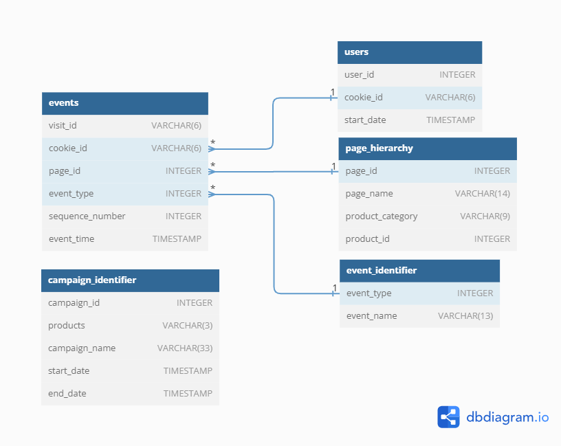

# Case Study #6: Clique Bait
The case study questions presented here are created by [**Data With Danny**](https://linktr.ee/datawithdanny). They are part of the [**8 Week SQL Challenge**](https://8weeksqlchallenge.com/).

My SQL queries are written in the `PostgreSQL 15` dialect, integrated into `Jupyter Notebook`, which allows us to instantly view the query results and document the queries.

For more details about the **Case Study #6**, click [**here**](https://8weeksqlchallenge.com/case-study-6/).

## Table of Contents

### [1. Importing Libraries](#Import)

### [2. Tables of the Database](#Tables)

### [3. Case Study Questions](#CaseStudyQuestions)

- [A. Enterprise Relationship Diagram](#A)
- [B. Digital Analysis](#B)
- [C. Product Funnel Analysis](#C)
- [D. Campaigns Analysis](#D)


<a id = 'Import'></a>
## 1. Importing Libraries


```python
import psycopg2 as pg2
import pandas as pd
import os
import warnings

warnings.filterwarnings("ignore")
```

### Connecting PostgreSQL database from Jupyter Notebook


```python
# Get my PostgreSQL password
mypassword = os.getenv("POSTGRESQL_PASSWORD")

# Connecting to database
conn = pg2.connect(user = 'postgres', password = mypassword, database = 'clique_bait')
cursor = conn.cursor()
```

___
<a id = 'Tables'></a>
## 2. Tables of the Database

First, let's verify if the connected database contains the 5 dataset names. 


```python
cursor.execute("""
SELECT table_schema, table_name
FROM information_schema.tables
WHERE table_schema = 'clique_bait'
""")

table_names = []
print('--- Tables within "data_mart" database --- ')
for table in cursor:
    print(table[1])
    table_names.append(table[1])
```

    --- Tables within "data_mart" database --- 
    event_identifier
    campaign_identifier
    page_hierarchy
    users
    events
    

#### Here are the 5 datasets of the "clique_bait" database. For more details about each dataset, please click [here](https://8weeksqlchallenge.com/case-study-6/).


```python
for table in table_names:
    print("\nTable: ", table)
    display(pd.read_sql("SELECT * FROM clique_bait." + table, conn))
```

    
    Table:  event_identifier
    
<table border="1" class="dataframe">
  <thead>
    <tr style="text-align: right;">
      <th></th>
      <th>event_type</th>
      <th>event_name</th>
    </tr>
  </thead>
  <tbody>
    <tr>
      <th>0</th>
      <td>1</td>
      <td>Page View</td>
    </tr>
    <tr>
      <th>1</th>
      <td>2</td>
      <td>Add to Cart</td>
    </tr>
    <tr>
      <th>2</th>
      <td>3</td>
      <td>Purchase</td>
    </tr>
    <tr>
      <th>3</th>
      <td>4</td>
      <td>Ad Impression</td>
    </tr>
    <tr>
      <th>4</th>
      <td>5</td>
      <td>Ad Click</td>
    </tr>
  </tbody>
</table>
</div>


    
    Table:  campaign_identifier
    
<table border="1" class="dataframe">
  <thead>
    <tr style="text-align: right;">
      <th></th>
      <th>campaign_id</th>
      <th>products</th>
      <th>campaign_name</th>
      <th>start_date</th>
      <th>end_date</th>
    </tr>
  </thead>
  <tbody>
    <tr>
      <th>0</th>
      <td>1</td>
      <td>1-3</td>
      <td>BOGOF - Fishing For Compliments</td>
      <td>2020-01-01</td>
      <td>2020-01-14</td>
    </tr>
    <tr>
      <th>1</th>
      <td>2</td>
      <td>4-5</td>
      <td>25% Off - Living The Lux Life</td>
      <td>2020-01-15</td>
      <td>2020-01-28</td>
    </tr>
    <tr>
      <th>2</th>
      <td>3</td>
      <td>6-8</td>
      <td>Half Off - Treat Your Shellf(ish)</td>
      <td>2020-02-01</td>
      <td>2020-03-31</td>
    </tr>
  </tbody>
</table>
</div>


    
    Table:  page_hierarchy
    
<table border="1" class="dataframe">
  <thead>
    <tr style="text-align: right;">
      <th></th>
      <th>page_id</th>
      <th>page_name</th>
      <th>product_category</th>
      <th>product_id</th>
    </tr>
  </thead>
  <tbody>
    <tr>
      <th>0</th>
      <td>1</td>
      <td>Home Page</td>
      <td>None</td>
      <td>NaN</td>
    </tr>
    <tr>
      <th>1</th>
      <td>2</td>
      <td>All Products</td>
      <td>None</td>
      <td>NaN</td>
    </tr>
    <tr>
      <th>2</th>
      <td>3</td>
      <td>Salmon</td>
      <td>Fish</td>
      <td>1.0</td>
    </tr>
    <tr>
      <th>3</th>
      <td>4</td>
      <td>Kingfish</td>
      <td>Fish</td>
      <td>2.0</td>
    </tr>
    <tr>
      <th>4</th>
      <td>5</td>
      <td>Tuna</td>
      <td>Fish</td>
      <td>3.0</td>
    </tr>
    <tr>
      <th>5</th>
      <td>6</td>
      <td>Russian Caviar</td>
      <td>Luxury</td>
      <td>4.0</td>
    </tr>
    <tr>
      <th>6</th>
      <td>7</td>
      <td>Black Truffle</td>
      <td>Luxury</td>
      <td>5.0</td>
    </tr>
    <tr>
      <th>7</th>
      <td>8</td>
      <td>Abalone</td>
      <td>Shellfish</td>
      <td>6.0</td>
    </tr>
    <tr>
      <th>8</th>
      <td>9</td>
      <td>Lobster</td>
      <td>Shellfish</td>
      <td>7.0</td>
    </tr>
    <tr>
      <th>9</th>
      <td>10</td>
      <td>Crab</td>
      <td>Shellfish</td>
      <td>8.0</td>
    </tr>
    <tr>
      <th>10</th>
      <td>11</td>
      <td>Oyster</td>
      <td>Shellfish</td>
      <td>9.0</td>
    </tr>
    <tr>
      <th>11</th>
      <td>12</td>
      <td>Checkout</td>
      <td>None</td>
      <td>NaN</td>
    </tr>
    <tr>
      <th>12</th>
      <td>13</td>
      <td>Confirmation</td>
      <td>None</td>
      <td>NaN</td>
    </tr>
  </tbody>
</table>
</div>


    
    Table:  users

<table border="1" class="dataframe">
  <thead>
    <tr style="text-align: right;">
      <th></th>
      <th>user_id</th>
      <th>cookie_id</th>
      <th>start_date</th>
    </tr>
  </thead>
  <tbody>
    <tr>
      <th>0</th>
      <td>1</td>
      <td>c4ca42</td>
      <td>2020-02-04</td>
    </tr>
    <tr>
      <th>1</th>
      <td>2</td>
      <td>c81e72</td>
      <td>2020-01-18</td>
    </tr>
    <tr>
      <th>2</th>
      <td>3</td>
      <td>eccbc8</td>
      <td>2020-02-21</td>
    </tr>
    <tr>
      <th>3</th>
      <td>4</td>
      <td>a87ff6</td>
      <td>2020-02-22</td>
    </tr>
    <tr>
      <th>4</th>
      <td>5</td>
      <td>e4da3b</td>
      <td>2020-02-01</td>
    </tr>
    <tr>
      <th>...</th>
      <td>...</td>
      <td>...</td>
      <td>...</td>
    </tr>
    <tr>
      <th>1777</th>
      <td>25</td>
      <td>46dd2f</td>
      <td>2020-03-29</td>
    </tr>
    <tr>
      <th>1778</th>
      <td>94</td>
      <td>59511b</td>
      <td>2020-03-22</td>
    </tr>
    <tr>
      <th>1779</th>
      <td>49</td>
      <td>d345a8</td>
      <td>2020-02-23</td>
    </tr>
    <tr>
      <th>1780</th>
      <td>211</td>
      <td>a26e03</td>
      <td>2020-02-20</td>
    </tr>
    <tr>
      <th>1781</th>
      <td>64</td>
      <td>87a4ba</td>
      <td>2020-03-18</td>
    </tr>
  </tbody>
</table>
<p>1782 rows × 3 columns</p>
</div>


    
    Table:  events

<table border="1" class="dataframe">
  <thead>
    <tr style="text-align: right;">
      <th></th>
      <th>visit_id</th>
      <th>cookie_id</th>
      <th>page_id</th>
      <th>event_type</th>
      <th>sequence_number</th>
      <th>event_time</th>
    </tr>
  </thead>
  <tbody>
    <tr>
      <th>0</th>
      <td>ccf365</td>
      <td>c4ca42</td>
      <td>1</td>
      <td>1</td>
      <td>1</td>
      <td>2020-02-04 19:16:09.182546</td>
    </tr>
    <tr>
      <th>1</th>
      <td>ccf365</td>
      <td>c4ca42</td>
      <td>2</td>
      <td>1</td>
      <td>2</td>
      <td>2020-02-04 19:16:17.358191</td>
    </tr>
    <tr>
      <th>2</th>
      <td>ccf365</td>
      <td>c4ca42</td>
      <td>6</td>
      <td>1</td>
      <td>3</td>
      <td>2020-02-04 19:16:58.454669</td>
    </tr>
    <tr>
      <th>3</th>
      <td>ccf365</td>
      <td>c4ca42</td>
      <td>9</td>
      <td>1</td>
      <td>4</td>
      <td>2020-02-04 19:16:58.609142</td>
    </tr>
    <tr>
      <th>4</th>
      <td>ccf365</td>
      <td>c4ca42</td>
      <td>9</td>
      <td>2</td>
      <td>5</td>
      <td>2020-02-04 19:17:51.729420</td>
    </tr>
    <tr>
      <th>...</th>
      <td>...</td>
      <td>...</td>
      <td>...</td>
      <td>...</td>
      <td>...</td>
      <td>...</td>
    </tr>
    <tr>
      <th>32729</th>
      <td>355a6a</td>
      <td>87a4ba</td>
      <td>10</td>
      <td>1</td>
      <td>15</td>
      <td>2020-03-18 22:44:16.541396</td>
    </tr>
    <tr>
      <th>32730</th>
      <td>355a6a</td>
      <td>87a4ba</td>
      <td>11</td>
      <td>1</td>
      <td>16</td>
      <td>2020-03-18 22:44:18.900830</td>
    </tr>
    <tr>
      <th>32731</th>
      <td>355a6a</td>
      <td>87a4ba</td>
      <td>11</td>
      <td>2</td>
      <td>17</td>
      <td>2020-03-18 22:45:12.670472</td>
    </tr>
    <tr>
      <th>32732</th>
      <td>355a6a</td>
      <td>87a4ba</td>
      <td>12</td>
      <td>1</td>
      <td>18</td>
      <td>2020-03-18 22:45:54.081818</td>
    </tr>
    <tr>
      <th>32733</th>
      <td>355a6a</td>
      <td>87a4ba</td>
      <td>13</td>
      <td>3</td>
      <td>19</td>
      <td>2020-03-18 22:45:54.984666</td>
    </tr>
  </tbody>
</table>
<p>32734 rows × 6 columns</p>
</div>


<a id = 'CaseStudyQuestions'></a>
## 3. Case Study Questions

<a id = 'A'></a>
## A. Enterprise Relationship Diagram
Using the following DDL schema details to create an ERD for all the Clique Bait datasets.</br>
[Click here](https://dbdiagram.io/) to access the DB Diagram tool to create the ERD.
</br>
</br>
</br>
**ANSWER**</br>
Here is the code that I used for creating the **ERD** for all the Clique Bait datasets on [DB Diagram tool](https://dbdiagram.io/). 

```
TABLE event_identifier {
  "event_type" INTEGER
  "event_name" VARCHAR(13)
}

TABLE campaign_identifier {
  "campaign_id" INTEGER
  "products" VARCHAR(3)
  "campaign_name" VARCHAR(33)
  "start_date" TIMESTAMP
  "end_date" TIMESTAMP
}

TABLE page_hierarchy {
  "page_id" INTEGER
  "page_name" VARCHAR(14)
  "product_category" VARCHAR(9)
  "product_id" INTEGER
}

TABLE users {
  "user_id" INTEGER
  "cookie_id" VARCHAR(6)
  "start_date" TIMESTAMP
}

TABLE events {
  "visit_id" VARCHAR(6)
  "cookie_id" VARCHAR(6)
  "page_id" INTEGER
  "event_type" INTEGER
  "sequence_number" INTEGER
  "event_time" TIMESTAMP
}

// Establish connections or references between datasets
Ref: "events"."event_type" > "event_identifier"."event_type"
Ref: "events"."page_id" > "page_hierarchy"."page_id"
Ref: "events"."cookie_id" > "users"."cookie_id"
```

**Result**



<a id = 'B'></a>
## B. Digital Analysis

#### 1. How many users are there?


```python
pd.read_sql("""
SELECT COUNT(DISTINCT user_id) AS nb_users
FROM clique_bait.users;
""", conn)
```

<table border="1" class="dataframe">
  <thead>
    <tr style="text-align: right;">
      <th></th>
      <th>nb_users</th>
    </tr>
  </thead>
  <tbody>
    <tr>
      <th>0</th>
      <td>500</td>
    </tr>
  </tbody>
</table>
</div>


**Result**\
There are 500 users.

___
#### 2. How many cookies does each user have on average?


```python
pd.read_sql("""
SELECT ROUND(AVG(nb_cookie_ids))::INTEGER AS avg_cookies_per_user
FROM
(
    SELECT DISTINCT user_id, COUNT(cookie_id) AS nb_cookie_ids
    FROM clique_bait.users
    GROUP BY user_id
) nb_cookies_per_user;
""", conn)
```

<table border="1" class="dataframe">
  <thead>
    <tr style="text-align: right;">
      <th></th>
      <th>avg_cookies_per_user</th>
    </tr>
  </thead>
  <tbody>
    <tr>
      <th>0</th>
      <td>4</td>
    </tr>
  </tbody>
</table>
</div>


**Result**\
Each user has an average of 4 cookies.

___
#### 3. What is the unique number of visits by all users per month?


```python
pd.read_sql("""
SELECT 
    DATE_PART('month', u.start_date)::INTEGER AS month, 
    TO_CHAR(u.start_date,'Month') AS month_name,
    COUNT(DISTINCT e.visit_id) AS nb_visits
FROM clique_bait.users u
JOIN clique_bait.events e ON u.cookie_id = e.cookie_id
GROUP BY month, month_name
ORDER BY month
""", conn)
```

<table border="1" class="dataframe">
  <thead>
    <tr style="text-align: right;">
      <th></th>
      <th>month</th>
      <th>month_name</th>
      <th>nb_visits</th>
    </tr>
  </thead>
  <tbody>
    <tr>
      <th>0</th>
      <td>1</td>
      <td>January</td>
      <td>876</td>
    </tr>
    <tr>
      <th>1</th>
      <td>2</td>
      <td>February</td>
      <td>1488</td>
    </tr>
    <tr>
      <th>2</th>
      <td>3</td>
      <td>March</td>
      <td>916</td>
    </tr>
    <tr>
      <th>3</th>
      <td>4</td>
      <td>April</td>
      <td>248</td>
    </tr>
    <tr>
      <th>4</th>
      <td>5</td>
      <td>May</td>
      <td>36</td>
    </tr>
  </tbody>
</table>
</div>


**Result**
- The month of **February** has the highest number of visits on the Clique Bait website, with a total of 1,488 visits.
- Following February, **March** and **January** are the second and third most visited months, accounting for 916 visits and 876 visits, respectively.
- The month of **May** has the lowest number of visits, with only 36.

___
#### 4. What is the number of events for each event type?


```python
pd.read_sql("""
SELECT 
    ei.event_name, 
    COUNT(*) AS nb_events
FROM clique_bait.events e
JOIN clique_bait. event_identifier ei ON e.event_type = ei.event_type
GROUP BY ei.event_name
ORDER BY nb_events DESC
""", conn)
```

<table border="1" class="dataframe">
  <thead>
    <tr style="text-align: right;">
      <th></th>
      <th>event_name</th>
      <th>nb_events</th>
    </tr>
  </thead>
  <tbody>
    <tr>
      <th>0</th>
      <td>Page View</td>
      <td>20928</td>
    </tr>
    <tr>
      <th>1</th>
      <td>Add to Cart</td>
      <td>8451</td>
    </tr>
    <tr>
      <th>2</th>
      <td>Purchase</td>
      <td>1777</td>
    </tr>
    <tr>
      <th>3</th>
      <td>Ad Impression</td>
      <td>876</td>
    </tr>
    <tr>
      <th>4</th>
      <td>Ad Click</td>
      <td>702</td>
    </tr>
  </tbody>
</table>
</div>


**Result**
- **Page View** has the highest number of events, with a total of 20,928.
- Following Page View, **Add to Cart** and **Purchase** are the second and third most interacted pages, accounting for 8,451 events and 1,777 events, respectively.
- Taking into consideration that not all users receive a campaign impression and that not all users clicked on the impression advertisement, the **Ad Impression** page has been interacted with 876 times, and clicking the impression (see **Ad Click**) has occurred only 702 times.

___
#### 5. What is the percentage of visits which have a purchase event?


```python
pd.read_sql("""
SELECT 
    COUNT(*) AS nb_purchase_event,
    (SELECT COUNT(DISTINCT visit_id) FROM clique_bait.events) AS total_nb_visits,
    CONCAT(ROUND(COUNT(*)/(SELECT COUNT(DISTINCT visit_id) FROM clique_bait.events)::NUMERIC * 100, 1), ' %') AS purchase_percent
FROM clique_bait.events e
JOIN clique_bait.event_identifier ei ON e.event_type = ei.event_type
WHERE ei.event_name = 'Purchase'
""", conn)
```

<table border="1" class="dataframe">
  <thead>
    <tr style="text-align: right;">
      <th></th>
      <th>nb_purchase_event</th>
      <th>total_nb_visits</th>
      <th>purchase_percent</th>
    </tr>
  </thead>
  <tbody>
    <tr>
      <th>0</th>
      <td>1777</td>
      <td>3564</td>
      <td>49.9 %</td>
    </tr>
  </tbody>
</table>
</div>


**Result**\
49.9% of the visits resulted in a purchase event.

___
#### 6. What is the percentage of visits which view the checkout page but do not have a purchase event?


```python
pd.read_sql("""
SELECT 
    (nb_checkouts - nb_purchases) AS nb_checkouts_without_purchase,
    (SELECT COUNT(DISTINCT visit_id) FROM clique_bait.events) AS total_visits,
    ROUND((nb_checkouts - nb_purchases)/(SELECT COUNT(DISTINCT visit_id) FROM clique_bait.events)::NUMERIC * 100,2) AS percent
FROM
(
    SELECT 
        SUM(CASE WHEN ph.page_name = 'Checkout' AND ei.event_name = 'Page View' THEN 1 ELSE 0 END) AS nb_checkouts,
        SUM(CASE WHEN ei.event_name = 'Purchase' THEN 1 ELSE 0 END) AS nb_purchases
    FROM clique_bait.events e 
    JOIN clique_bait.event_identifier ei ON e.event_type = ei.event_type
    JOIN clique_bait.page_hierarchy ph ON e.page_id = ph.page_id
) c
""", conn)
```

<table border="1" class="dataframe">
  <thead>
    <tr style="text-align: right;">
      <th></th>
      <th>nb_checkouts_without_purchase</th>
      <th>total_visits</th>
      <th>percent</th>
    </tr>
  </thead>
  <tbody>
    <tr>
      <th>0</th>
      <td>326</td>
      <td>3564</td>
      <td>9.15</td>
    </tr>
  </tbody>
</table>
</div>


**Result**\
Only 9.15% of the visits resulted in viewing the checkout page without a purchase event.

___
#### 7. What are the top 3 pages by number of views?


```python
pd.read_sql("""
SELECT 
    ph.page_name, 
    COUNT(*) AS nb_views
FROM clique_bait.events e
JOIN clique_bait.page_hierarchy ph ON e.page_id = ph.page_id
JOIN clique_bait.event_identifier ei ON e.event_type = ei.event_type
WHERE ei.event_name = 'Page View'
GROUP BY ph.page_name
ORDER BY nb_views DESC
LIMIT 3
""", conn)
```

<table border="1" class="dataframe">
  <thead>
    <tr style="text-align: right;">
      <th></th>
      <th>page_name</th>
      <th>nb_views</th>
    </tr>
  </thead>
  <tbody>
    <tr>
      <th>0</th>
      <td>All Products</td>
      <td>3174</td>
    </tr>
    <tr>
      <th>1</th>
      <td>Checkout</td>
      <td>2103</td>
    </tr>
    <tr>
      <th>2</th>
      <td>Home Page</td>
      <td>1782</td>
    </tr>
  </tbody>
</table>
</div>


___
#### 8. What is the number of views and cart adds for each product category?


```python
pd.read_sql("""
SELECT 
    ph.product_category, 
    SUM(CASE WHEN event_name = 'Page View' THEN 1 ELSE 0 END) AS nb_views,
    SUM(CASE WHEN event_name = 'Add to Cart' THEN 1 ELSE 0 END) AS nb_card_adds
FROM clique_bait.events e
JOIN clique_bait.page_hierarchy ph ON e.page_id = ph.page_id
JOIN clique_bait.event_identifier ei ON e.event_type = ei.event_type
WHERE ph.product_category IS NOT NULL
GROUP BY ph.product_category
ORDER BY nb_views DESC
""", conn)
```

<table border="1" class="dataframe">
  <thead>
    <tr style="text-align: right;">
      <th></th>
      <th>product_category</th>
      <th>nb_views</th>
      <th>nb_card_adds</th>
    </tr>
  </thead>
  <tbody>
    <tr>
      <th>0</th>
      <td>Shellfish</td>
      <td>6204</td>
      <td>3792</td>
    </tr>
    <tr>
      <th>1</th>
      <td>Fish</td>
      <td>4633</td>
      <td>2789</td>
    </tr>
    <tr>
      <th>2</th>
      <td>Luxury</td>
      <td>3032</td>
      <td>1870</td>
    </tr>
  </tbody>
</table>
</div>


___
#### 9. What are the top 3 products by purchases?


```python
pd.read_sql("""
WITH visitID_with_purchases_cte AS
(
    -- Retrieve visit IDS that have made purchases
    
    SELECT e.visit_id
    FROM clique_bait.events e
    JOIN clique_bait.event_identifier ei ON e.event_type = ei.event_type
    WHERE ei.event_name = 'Purchase'
)
SELECT 
    ph.page_name as product, 
    COUNT(*) AS nb_purchases
FROM visitID_with_purchases_cte cte
JOIN clique_bait.events e ON cte.visit_id = e.visit_id
JOIN clique_bait.event_identifier ei ON e.event_type = ei.event_type
JOIN clique_bait.page_hierarchy ph ON e.page_id = ph.page_id
WHERE ph.product_category IS NOT NULL 
AND ei.event_name = 'Add to Cart'
GROUP BY ph.page_name 
ORDER BY nb_purchases DESC
LIMIT 3
""", conn)
```

<table border="1" class="dataframe">
  <thead>
    <tr style="text-align: right;">
      <th></th>
      <th>product</th>
      <th>nb_purchases</th>
    </tr>
  </thead>
  <tbody>
    <tr>
      <th>0</th>
      <td>Lobster</td>
      <td>754</td>
    </tr>
    <tr>
      <th>1</th>
      <td>Oyster</td>
      <td>726</td>
    </tr>
    <tr>
      <th>2</th>
      <td>Crab</td>
      <td>719</td>
    </tr>
  </tbody>
</table>
</div>


Alternatively, we can utilize the Window Function `LAST_VALUE() OVER (PARTITION BY... ORDER BY...)` to extract the most recent event recorded during each visit on the Clique Bait website. The **Purchase** event typically represents the final action taken by users in each visit. Therefore, by applying the `LAST_VALUE()` in the `add_last_event_cte`, we can subsequently filter and identify the products that have indeed been purchased, as indicated in the following statement:</br> `WHERE event_name = 'Add to Cart' AND last_event = 'Purchase'`.


```python
pd.read_sql("""
WITH add_last_event_cte AS
(
    SELECT         
        e.visit_id,
        e.sequence_number,
        ph.page_name, 
        ph.product_category,
        ei.event_name,
        LAST_VALUE(ei.event_name) OVER (PARTITION BY e.visit_id ORDER BY e.sequence_number ROWS BETWEEN UNBOUNDED preceding AND UNBOUNDED following) AS last_event
    FROM clique_bait.events e 
    JOIN clique_bait.event_identifier ei ON e.event_type = ei.event_type
    JOIN clique_bait.page_hierarchy ph ON e.page_id = ph.page_id
)
SELECT 
    page_name, 
    COUNT(event_name) AS nb_purchases
FROM add_last_event_cte
WHERE product_category IS NOT NULL AND event_name = 'Add to Cart' AND last_event = 'Purchase'
GROUP BY page_name
ORDER BY nb_purchases DESC
""", conn)
```

<table border="1" class="dataframe">
  <thead>
    <tr style="text-align: right;">
      <th></th>
      <th>page_name</th>
      <th>nb_purchases</th>
    </tr>
  </thead>
  <tbody>
    <tr>
      <th>0</th>
      <td>Lobster</td>
      <td>754</td>
    </tr>
    <tr>
      <th>1</th>
      <td>Oyster</td>
      <td>726</td>
    </tr>
    <tr>
      <th>2</th>
      <td>Crab</td>
      <td>719</td>
    </tr>
    <tr>
      <th>3</th>
      <td>Salmon</td>
      <td>711</td>
    </tr>
    <tr>
      <th>4</th>
      <td>Black Truffle</td>
      <td>707</td>
    </tr>
    <tr>
      <th>5</th>
      <td>Kingfish</td>
      <td>707</td>
    </tr>
    <tr>
      <th>6</th>
      <td>Abalone</td>
      <td>699</td>
    </tr>
    <tr>
      <th>7</th>
      <td>Russian Caviar</td>
      <td>697</td>
    </tr>
    <tr>
      <th>8</th>
      <td>Tuna</td>
      <td>697</td>
    </tr>
  </tbody>
</table>
</div>


<a id = 'C'></a>
## C. Product Funnel Analysis
Using a single SQL query - create a new output table which has the following details:

- How many times was each product viewed?
- How many times was each product added to cart?
- How many times was each product added to a cart but not purchased (abandoned)?
- How many times was each product purchased?

Additionally, create another table which further aggregates the data for the above points but this time **for each product category** instead of individual products.

### Table 1: Aggregate the data by products


```python
# Create table
cursor.execute("DROP TABLE IF EXISTS clique_bait.products;")
cursor.execute("""
CREATE TABLE clique_bait.products
(
    "product" VARCHAR(255),
    "nb_views" INTEGER,
    "nb_cart_adds" INTEGER,
    "nb_abandoned" INTEGER,
    "nb_purchases" INTEGER
);
""")


# Populate the table
cursor.execute("""
INSERT INTO clique_bait.products
WITH add_last_event_cte AS
(
    SELECT 
        e.visit_id,
        e.sequence_number,
        ph.page_name, 
        ph.product_category,
        ei.event_name,
        LAST_VALUE(ei.event_name) OVER (PARTITION BY e.visit_id ORDER BY e.sequence_number ROWS BETWEEN UNBOUNDED preceding AND UNBOUNDED following) AS last_event 
    FROM clique_bait.events e 
    JOIN clique_bait.event_identifier ei ON e.event_type = ei.event_type
    JOIN clique_bait.page_hierarchy ph ON e.page_id = ph.page_id
)
SELECT 
    page_name AS product, 
    SUM(CASE WHEN event_name = 'Page View' THEN 1 ELSE 0 END) AS nb_views,
    SUM(CASE WHEN event_name = 'Add to Cart' THEN 1 ELSE 0 END) AS nb_cart_adds,
    SUM(CASE WHEN event_name = 'Add to Cart' AND last_event != 'Purchase' THEN 1 ELSE 0 END) AS nb_abandoned,
    SUM(CASE WHEN event_name = 'Add to Cart' AND last_event = 'Purchase' THEN 1 ELSE 0 END) AS nb_purchases
FROM add_last_event_cte
WHERE product_category IS NOT NULL 
GROUP BY page_name
""")


# Saving
conn.commit()
```

**Result**


```python
pd.read_sql("""SELECT * FROM clique_bait.products""", conn)
```

<table border="1" class="dataframe">
  <thead>
    <tr style="text-align: right;">
      <th></th>
      <th>product</th>
      <th>nb_views</th>
      <th>nb_cart_adds</th>
      <th>nb_abandoned</th>
      <th>nb_purchases</th>
    </tr>
  </thead>
  <tbody>
    <tr>
      <th>0</th>
      <td>Abalone</td>
      <td>1525</td>
      <td>932</td>
      <td>233</td>
      <td>699</td>
    </tr>
    <tr>
      <th>1</th>
      <td>Oyster</td>
      <td>1568</td>
      <td>943</td>
      <td>217</td>
      <td>726</td>
    </tr>
    <tr>
      <th>2</th>
      <td>Salmon</td>
      <td>1559</td>
      <td>938</td>
      <td>227</td>
      <td>711</td>
    </tr>
    <tr>
      <th>3</th>
      <td>Crab</td>
      <td>1564</td>
      <td>949</td>
      <td>230</td>
      <td>719</td>
    </tr>
    <tr>
      <th>4</th>
      <td>Tuna</td>
      <td>1515</td>
      <td>931</td>
      <td>234</td>
      <td>697</td>
    </tr>
    <tr>
      <th>5</th>
      <td>Lobster</td>
      <td>1547</td>
      <td>968</td>
      <td>214</td>
      <td>754</td>
    </tr>
    <tr>
      <th>6</th>
      <td>Kingfish</td>
      <td>1559</td>
      <td>920</td>
      <td>213</td>
      <td>707</td>
    </tr>
    <tr>
      <th>7</th>
      <td>Russian Caviar</td>
      <td>1563</td>
      <td>946</td>
      <td>249</td>
      <td>697</td>
    </tr>
    <tr>
      <th>8</th>
      <td>Black Truffle</td>
      <td>1469</td>
      <td>924</td>
      <td>217</td>
      <td>707</td>
    </tr>
  </tbody>
</table>
</div>


### Table 2: Aggregate the data by product categories


```python
# Create the table
cursor.execute("DROP TABLE IF EXISTS clique_bait.product_category;")
cursor.execute("""
CREATE TABLE clique_bait.product_category
(
    "product" VARCHAR(255),
    "nb_views" INTEGER,
    "nb_cart_adds" INTEGER,
    "nb_abandoned" INTEGER,
    "nb_purchases" INTEGER
);
""")


# Populate the table
cursor.execute("""
INSERT INTO clique_bait.product_category
WITH add_last_event_cte AS
(
    SELECT 
        e.visit_id,
        e.sequence_number, 
        ph.product_category,
        ei.event_name,
        LAST_VALUE(ei.event_name) OVER (PARTITION BY e.visit_id ORDER BY e.sequence_number ROWS BETWEEN UNBOUNDED preceding AND UNBOUNDED following) AS last_event 
    FROM clique_bait.events e 
    JOIN clique_bait.event_identifier ei ON e.event_type = ei.event_type
    JOIN clique_bait.page_hierarchy ph ON e.page_id = ph.page_id
)
SELECT 
    product_category, 
    SUM(CASE WHEN event_name = 'Page View' THEN 1 ELSE 0 END) AS nb_views,
    SUM(CASE WHEN event_name = 'Add to Cart' THEN 1 ELSE 0 END) AS nb_cart_adds,
    SUM(CASE WHEN event_name = 'Add to Cart' AND last_event != 'Purchase' THEN 1 ELSE 0 END) AS nb_abandoned,
    SUM(CASE WHEN event_name = 'Add to Cart' AND last_event = 'Purchase' THEN 1 ELSE 0 END) AS nb_purchases
FROM add_last_event_cte
WHERE product_category IS NOT NULL 
GROUP BY product_category

""")

# Saving
conn.commit()
```

**Result**


```python
pd.read_sql("SELECT * FROM clique_bait.product_category", conn)
```

<table border="1" class="dataframe">
  <thead>
    <tr style="text-align: right;">
      <th></th>
      <th>product</th>
      <th>nb_views</th>
      <th>nb_cart_adds</th>
      <th>nb_abandoned</th>
      <th>nb_purchases</th>
    </tr>
  </thead>
  <tbody>
    <tr>
      <th>0</th>
      <td>Luxury</td>
      <td>3032</td>
      <td>1870</td>
      <td>466</td>
      <td>1404</td>
    </tr>
    <tr>
      <th>1</th>
      <td>Shellfish</td>
      <td>6204</td>
      <td>3792</td>
      <td>894</td>
      <td>2898</td>
    </tr>
    <tr>
      <th>2</th>
      <td>Fish</td>
      <td>4633</td>
      <td>2789</td>
      <td>674</td>
      <td>2115</td>
    </tr>
  </tbody>
</table>
</div>


___
### Use your 2 new output tables - answer the following questions:

#### 1. Which product had the most views, cart adds and purchases?


```python
pd.read_sql("""
SELECT 
    product, 
    nb_views, 
    nb_cart_adds, 
    nb_purchases
FROM clique_bait.products
ORDER BY nb_views DESC, nb_cart_adds DESC, nb_purchases DESC
LIMIT 1;
""", conn)
```

<table border="1" class="dataframe">
  <thead>
    <tr style="text-align: right;">
      <th></th>
      <th>product</th>
      <th>nb_views</th>
      <th>nb_cart_adds</th>
      <th>nb_purchases</th>
    </tr>
  </thead>
  <tbody>
    <tr>
      <th>0</th>
      <td>Oyster</td>
      <td>1568</td>
      <td>943</td>
      <td>726</td>
    </tr>
  </tbody>
</table>
</div>


The output above shows that **Oyster** is the product that had the most views, cart adds and purchases.</br>
Alternatively, we could break down the data for each individual product, which reveals that:

- **Oyster** is the most viewed product.
- **Lobster** is the most added product to cart and the most purchased product


```python
pd.read_sql("""
WITH max_cte AS 
(
    SELECT
     *,
     CASE WHEN MAX(nb_views) OVER (ORDER BY nb_views DESC) = nb_views THEN product ELSE ''  END AS most_viewed,
     CASE WHEN MAX(nb_cart_adds) OVER (ORDER BY nb_cart_adds DESC) = nb_cart_adds THEN product ELSE ''  END AS most_cart_added,
     CASE WHEN MAX(nb_purchases) OVER (ORDER BY nb_purchases DESC) = nb_purchases THEN product ELSE ''  END AS most_purchased
    FROM clique_bait.products
)
SELECT most_viewed, most_cart_added, most_purchased
FROM max_cte
WHERE most_viewed != '' OR most_cart_added !='' OR most_purchased !=''
""", conn)
```

<table border="1" class="dataframe">
  <thead>
    <tr style="text-align: right;">
      <th></th>
      <th>most_viewed</th>
      <th>most_cart_added</th>
      <th>most_purchased</th>
    </tr>
  </thead>
  <tbody>
    <tr>
      <th>0</th>
      <td>Oyster</td>
      <td></td>
      <td></td>
    </tr>
    <tr>
      <th>1</th>
      <td></td>
      <td>Lobster</td>
      <td>Lobster</td>
    </tr>
  </tbody>
</table>
</div>


___
#### 2. Which product was most likely to be abandoned?


```python
pd.read_sql("""
SELECT product, nb_abandoned
FROM clique_bait.products
ORDER BY nb_abandoned DESC
LIMIT 1;
""", conn)
```

<table border="1" class="dataframe">
  <thead>
    <tr style="text-align: right;">
      <th></th>
      <th>product</th>
      <th>nb_abandoned</th>
    </tr>
  </thead>
  <tbody>
    <tr>
      <th>0</th>
      <td>Russian Caviar</td>
      <td>249</td>
    </tr>
  </tbody>
</table>
</div>


___
#### 3. Which product had the highest view to purchase percentage?


```python
pd.read_sql("""
SELECT 
    product, 
    nb_views, 
    nb_purchases, 
    CONCAT(ROUND(nb_purchases/nb_views::NUMERIC * 100,2), ' %') AS percent
FROM clique_bait.products
ORDER BY percent DESC
LIMIT 1;
""", conn)
```

<table border="1" class="dataframe">
  <thead>
    <tr style="text-align: right;">
      <th></th>
      <th>product</th>
      <th>nb_views</th>
      <th>nb_purchases</th>
      <th>percent</th>
    </tr>
  </thead>
  <tbody>
    <tr>
      <th>0</th>
      <td>Lobster</td>
      <td>1547</td>
      <td>754</td>
      <td>48.74 %</td>
    </tr>
  </tbody>
</table>
</div>


___
#### 4. What is the average conversion rate from view to cart add?


```python
pd.read_sql("""
SELECT 
    CONCAT(ROUND(AVG(nb_cart_adds/nb_views::NUMERIC * 100),2), ' %') AS conversion_rate
FROM clique_bait.products
""", conn)
```

<table border="1" class="dataframe">
  <thead>
    <tr style="text-align: right;">
      <th></th>
      <th>conversion_rate</th>
    </tr>
  </thead>
  <tbody>
    <tr>
      <th>0</th>
      <td>60.95 %</td>
    </tr>
  </tbody>
</table>
</div>


___
#### 5. What is the average conversion rate from cart add to purchase?


```python
pd.read_sql("""
SELECT 
    CONCAT(ROUND(AVG(nb_purchases/nb_cart_adds::NUMERIC * 100),2), ' %') AS conversion_rate
FROM clique_bait.products
""", conn)
```

<table border="1" class="dataframe">
  <thead>
    <tr style="text-align: right;">
      <th></th>
      <th>conversion_rate</th>
    </tr>
  </thead>
  <tbody>
    <tr>
      <th>0</th>
      <td>75.93 %</td>
    </tr>
  </tbody>
</table>
</div>


<a id = 'D'></a>
## D. Campaigns Analysis
Generate a table that has 1 single row for every unique `visit_id` record and has the following columns:

- `user_id`
- `visit_id`
- `visit_start_time`: the earliest event_time for each visit
- `page_views`: count of page views for each visit
- `cart_adds`: count of product cart add events for each visit
- `purchase`: 1/0 flag if a purchase event exists for each visit
- `campaign_name`: map the visit to a campaign if the visit_start_time falls between the start_date and end_date
- `impression`: count of ad impressions for each visit
- `click`: count of ad clicks for each visit
- `cart_products`**(Optional column)**: a comma separated text value with products added to the cart sorted by the order they were added to the cart (hint: use the `sequence_number`)

Use the subsequent dataset to generate at least 5 insights for the Clique Bait team - bonus: prepare a single A4 infographic that the team can use for their management reporting sessions, be sure to emphasise the most important points from your findings.

Some ideas you might want to investigate further include:

- Identifying users who have received impressions during each campaign period and comparing each metric with other users who did not have an impression event
- Does clicking on an impression lead to higher purchase rates?
- What is the uplift in purchase rate when comparing users who click on a campaign impression versus users who do not receive an impression? What if we compare them with users who just an impression but do not click?
- What metrics can you use to quantify the success or failure of each campaign compared to eachother?


```python
# Create table
cursor.execute("DROP TABLE IF EXISTS clique_bait.campaign_analysis;")
cursor.execute("""
CREATE TABLE clique_bait.campaign_analysis
(
    "user_id" INTEGER,
    "visit_id" VARCHAR(6),
    "visit_start_time" TIMESTAMP,
    "page_views" INTEGER,
    "cart_adds" INTEGER,
    "purchases" INTEGER,
    "impressions" INTEGER,
    "clicks" INTEGER,
    "campaign_name" VARCHAR(33),
    "cart_products" VARCHAR(255)
);
""")


# Populate the table
cursor.execute("""
INSERT INTO clique_bait.campaign_analysis
WITH cart_products_cte AS
(
    -- Generate a sequence of products added to the cart  
    
    SELECT    
        u.user_id, 
        e.visit_id,
        STRING_AGG(ph.page_name, ', ' ORDER BY sequence_number) AS cart_products
    FROM clique_bait.users u
    JOIN clique_bait.events e ON u.cookie_id = e.cookie_id
    JOIN clique_bait.page_hierarchy ph ON e.page_id = ph.page_id
    JOIN clique_bait.event_identifier ei ON e.event_type = ei.event_type
    WHERE ei.event_name = 'Add to Cart'
    GROUP BY u.user_id, e.visit_id
)

SELECT 
    u.user_id, 
    e.visit_id, 
    MIN(e.event_time) AS visit_start_time,
    SUM(CASE WHEN ei.event_name = 'Page View' THEN 1 ELSE 0 END) AS page_views,
    SUM(CASE WHEN ei.event_name = 'Add to Cart' THEN 1 ELSE 0 END) AS cart_adds,
    SUM(CASE WHEN ei.event_name = 'Purchase' THEN 1 ELSE 0 END) AS purchases,
    SUM(CASE WHEN ei.event_name = 'Ad Impression' THEN 1 ELSE 0 END) AS impressions,
    SUM(CASE WHEN ei.event_name = 'Ad Click' THEN 1 ELSE 0 END) AS clicks,
    CASE WHEN MIN(e.event_time) BETWEEN ci.start_date AND ci.end_date THEN ci.campaign_name ELSE '' END AS campaign_name,
    CASE WHEN cp.cart_products IS NULL THEN '' ELSE cp.cart_products END AS cart_products
   
FROM clique_bait.users u
JOIN clique_bait.events e ON u.cookie_id = e.cookie_id
JOIN clique_bait.page_hierarchy ph ON e.page_id = ph.page_id
JOIN clique_bait.event_identifier ei ON e.event_type = ei.event_type
JOIN clique_bait.campaign_identifier ci ON e.event_time BETWEEN ci.start_date AND ci.end_date
LEFT JOIN cart_products_cte cp ON cp.user_id = u.user_id AND cp.visit_id = e.visit_id
GROUP BY u.user_id, e.visit_id, ci.start_date, ci.end_date, ci.campaign_name, cp.cart_products
ORDER BY u.user_id, e.visit_id;
""")


# Saving the updates
conn.commit()
```

**Result**</br>
Here is the table listing the first 5 users only.


```python
pd.read_sql("""
SELECT * 
FROM clique_bait.campaign_analysis
WHERE user_id < 6
""", conn)
```

<table border="1" class="dataframe">
  <thead>
    <tr style="text-align: right;">
      <th></th>
      <th>user_id</th>
      <th>visit_id</th>
      <th>visit_start_time</th>
      <th>page_views</th>
      <th>cart_adds</th>
      <th>purchases</th>
      <th>impressions</th>
      <th>clicks</th>
      <th>campaign_name</th>
      <th>cart_products</th>
    </tr>
  </thead>
  <tbody>
    <tr>
      <th>0</th>
      <td>1</td>
      <td>02a5d5</td>
      <td>2020-02-26 16:57:26.260871</td>
      <td>4</td>
      <td>0</td>
      <td>0</td>
      <td>0</td>
      <td>0</td>
      <td>Half Off - Treat Your Shellf(ish)</td>
      <td></td>
    </tr>
    <tr>
      <th>1</th>
      <td>1</td>
      <td>0826dc</td>
      <td>2020-02-26 05:58:37.918618</td>
      <td>1</td>
      <td>0</td>
      <td>0</td>
      <td>0</td>
      <td>0</td>
      <td>Half Off - Treat Your Shellf(ish)</td>
      <td></td>
    </tr>
    <tr>
      <th>2</th>
      <td>1</td>
      <td>0fc437</td>
      <td>2020-02-04 17:49:49.602976</td>
      <td>10</td>
      <td>6</td>
      <td>1</td>
      <td>1</td>
      <td>1</td>
      <td>Half Off - Treat Your Shellf(ish)</td>
      <td>Tuna, Russian Caviar, Black Truffle, Abalone, ...</td>
    </tr>
    <tr>
      <th>3</th>
      <td>1</td>
      <td>30b94d</td>
      <td>2020-03-15 13:12:54.023936</td>
      <td>9</td>
      <td>7</td>
      <td>1</td>
      <td>1</td>
      <td>1</td>
      <td>Half Off - Treat Your Shellf(ish)</td>
      <td>Salmon, Kingfish, Tuna, Russian Caviar, Abalon...</td>
    </tr>
    <tr>
      <th>4</th>
      <td>1</td>
      <td>41355d</td>
      <td>2020-03-25 00:11:17.860655</td>
      <td>6</td>
      <td>1</td>
      <td>0</td>
      <td>0</td>
      <td>0</td>
      <td>Half Off - Treat Your Shellf(ish)</td>
      <td>Lobster</td>
    </tr>
    <tr>
      <th>5</th>
      <td>1</td>
      <td>ccf365</td>
      <td>2020-02-04 19:16:09.182546</td>
      <td>7</td>
      <td>3</td>
      <td>1</td>
      <td>0</td>
      <td>0</td>
      <td>Half Off - Treat Your Shellf(ish)</td>
      <td>Lobster, Crab, Oyster</td>
    </tr>
    <tr>
      <th>6</th>
      <td>1</td>
      <td>eaffde</td>
      <td>2020-03-25 20:06:32.342989</td>
      <td>10</td>
      <td>8</td>
      <td>1</td>
      <td>1</td>
      <td>1</td>
      <td>Half Off - Treat Your Shellf(ish)</td>
      <td>Salmon, Tuna, Russian Caviar, Black Truffle, A...</td>
    </tr>
    <tr>
      <th>7</th>
      <td>1</td>
      <td>f7c798</td>
      <td>2020-03-15 02:23:26.312543</td>
      <td>9</td>
      <td>3</td>
      <td>1</td>
      <td>0</td>
      <td>0</td>
      <td>Half Off - Treat Your Shellf(ish)</td>
      <td>Russian Caviar, Crab, Oyster</td>
    </tr>
    <tr>
      <th>8</th>
      <td>2</td>
      <td>0635fb</td>
      <td>2020-02-16 06:42:42.735730</td>
      <td>9</td>
      <td>4</td>
      <td>1</td>
      <td>0</td>
      <td>0</td>
      <td>Half Off - Treat Your Shellf(ish)</td>
      <td>Salmon, Kingfish, Abalone, Crab</td>
    </tr>
    <tr>
      <th>9</th>
      <td>2</td>
      <td>1f1198</td>
      <td>2020-02-01 21:51:55.078775</td>
      <td>1</td>
      <td>0</td>
      <td>0</td>
      <td>0</td>
      <td>0</td>
      <td>Half Off - Treat Your Shellf(ish)</td>
      <td></td>
    </tr>
    <tr>
      <th>10</th>
      <td>2</td>
      <td>3b5871</td>
      <td>2020-01-18 10:16:32.158475</td>
      <td>9</td>
      <td>6</td>
      <td>1</td>
      <td>1</td>
      <td>1</td>
      <td>25% Off - Living The Lux Life</td>
      <td>Salmon, Kingfish, Russian Caviar, Black Truffl...</td>
    </tr>
    <tr>
      <th>11</th>
      <td>2</td>
      <td>49d73d</td>
      <td>2020-02-16 06:21:27.138532</td>
      <td>11</td>
      <td>9</td>
      <td>1</td>
      <td>1</td>
      <td>1</td>
      <td>Half Off - Treat Your Shellf(ish)</td>
      <td>Salmon, Kingfish, Tuna, Russian Caviar, Black ...</td>
    </tr>
    <tr>
      <th>12</th>
      <td>2</td>
      <td>910d9a</td>
      <td>2020-02-01 10:40:46.875968</td>
      <td>8</td>
      <td>1</td>
      <td>0</td>
      <td>0</td>
      <td>0</td>
      <td>Half Off - Treat Your Shellf(ish)</td>
      <td>Abalone</td>
    </tr>
    <tr>
      <th>13</th>
      <td>2</td>
      <td>c5c0ee</td>
      <td>2020-01-18 10:35:22.765382</td>
      <td>1</td>
      <td>0</td>
      <td>0</td>
      <td>0</td>
      <td>0</td>
      <td>25% Off - Living The Lux Life</td>
      <td></td>
    </tr>
    <tr>
      <th>14</th>
      <td>2</td>
      <td>d58cbd</td>
      <td>2020-01-18 23:40:54.761906</td>
      <td>8</td>
      <td>4</td>
      <td>0</td>
      <td>0</td>
      <td>0</td>
      <td>25% Off - Living The Lux Life</td>
      <td>Kingfish, Tuna, Abalone, Crab</td>
    </tr>
    <tr>
      <th>15</th>
      <td>2</td>
      <td>e26a84</td>
      <td>2020-01-18 16:06:40.907280</td>
      <td>6</td>
      <td>2</td>
      <td>1</td>
      <td>0</td>
      <td>0</td>
      <td>25% Off - Living The Lux Life</td>
      <td>Salmon, Oyster</td>
    </tr>
    <tr>
      <th>16</th>
      <td>3</td>
      <td>25502e</td>
      <td>2020-02-21 11:26:15.353389</td>
      <td>1</td>
      <td>0</td>
      <td>0</td>
      <td>0</td>
      <td>0</td>
      <td>Half Off - Treat Your Shellf(ish)</td>
      <td></td>
    </tr>
    <tr>
      <th>17</th>
      <td>3</td>
      <td>9a2f24</td>
      <td>2020-02-21 03:19:10.032455</td>
      <td>6</td>
      <td>2</td>
      <td>1</td>
      <td>0</td>
      <td>0</td>
      <td>Half Off - Treat Your Shellf(ish)</td>
      <td>Kingfish, Black Truffle</td>
    </tr>
    <tr>
      <th>18</th>
      <td>3</td>
      <td>bf200a</td>
      <td>2020-03-11 04:10:26.708385</td>
      <td>7</td>
      <td>2</td>
      <td>1</td>
      <td>0</td>
      <td>0</td>
      <td>Half Off - Treat Your Shellf(ish)</td>
      <td>Salmon, Crab</td>
    </tr>
    <tr>
      <th>19</th>
      <td>3</td>
      <td>eb13cd</td>
      <td>2020-03-11 21:36:37.222763</td>
      <td>1</td>
      <td>0</td>
      <td>0</td>
      <td>0</td>
      <td>0</td>
      <td>Half Off - Treat Your Shellf(ish)</td>
      <td></td>
    </tr>
    <tr>
      <th>20</th>
      <td>4</td>
      <td>07a950</td>
      <td>2020-03-19 17:56:24.610445</td>
      <td>6</td>
      <td>0</td>
      <td>0</td>
      <td>0</td>
      <td>0</td>
      <td>Half Off - Treat Your Shellf(ish)</td>
      <td></td>
    </tr>
    <tr>
      <th>21</th>
      <td>4</td>
      <td>4c0ce3</td>
      <td>2020-02-22 19:42:45.498271</td>
      <td>1</td>
      <td>0</td>
      <td>0</td>
      <td>0</td>
      <td>0</td>
      <td>Half Off - Treat Your Shellf(ish)</td>
      <td></td>
    </tr>
    <tr>
      <th>22</th>
      <td>4</td>
      <td>7caba5</td>
      <td>2020-02-22 17:49:37.646174</td>
      <td>5</td>
      <td>2</td>
      <td>0</td>
      <td>0</td>
      <td>0</td>
      <td>Half Off - Treat Your Shellf(ish)</td>
      <td>Tuna, Lobster</td>
    </tr>
    <tr>
      <th>23</th>
      <td>4</td>
      <td>b90e25</td>
      <td>2020-03-19 11:01:58.182947</td>
      <td>9</td>
      <td>4</td>
      <td>1</td>
      <td>1</td>
      <td>1</td>
      <td>Half Off - Treat Your Shellf(ish)</td>
      <td>Tuna, Black Truffle, Lobster, Crab</td>
    </tr>
    <tr>
      <th>24</th>
      <td>5</td>
      <td>05c52a</td>
      <td>2020-02-11 12:30:33.479052</td>
      <td>9</td>
      <td>8</td>
      <td>0</td>
      <td>1</td>
      <td>1</td>
      <td>Half Off - Treat Your Shellf(ish)</td>
      <td>Salmon, Kingfish, Tuna, Russian Caviar, Black ...</td>
    </tr>
    <tr>
      <th>25</th>
      <td>5</td>
      <td>4bffe1</td>
      <td>2020-02-26 16:03:10.377881</td>
      <td>8</td>
      <td>1</td>
      <td>0</td>
      <td>0</td>
      <td>0</td>
      <td>Half Off - Treat Your Shellf(ish)</td>
      <td>Russian Caviar</td>
    </tr>
    <tr>
      <th>26</th>
      <td>5</td>
      <td>580bf6</td>
      <td>2020-02-11 04:05:42.307991</td>
      <td>8</td>
      <td>6</td>
      <td>0</td>
      <td>0</td>
      <td>0</td>
      <td>Half Off - Treat Your Shellf(ish)</td>
      <td>Salmon, Tuna, Russian Caviar, Black Truffle, A...</td>
    </tr>
    <tr>
      <th>27</th>
      <td>5</td>
      <td>b45feb</td>
      <td>2020-02-01 07:47:45.025247</td>
      <td>1</td>
      <td>0</td>
      <td>0</td>
      <td>0</td>
      <td>0</td>
      <td>Half Off - Treat Your Shellf(ish)</td>
      <td></td>
    </tr>
    <tr>
      <th>28</th>
      <td>5</td>
      <td>f61ed7</td>
      <td>2020-02-01 06:30:39.766168</td>
      <td>8</td>
      <td>2</td>
      <td>1</td>
      <td>0</td>
      <td>0</td>
      <td>Half Off - Treat Your Shellf(ish)</td>
      <td>Lobster, Crab</td>
    </tr>
    <tr>
      <th>29</th>
      <td>5</td>
      <td>fa70cb</td>
      <td>2020-02-26 11:12:20.361638</td>
      <td>1</td>
      <td>0</td>
      <td>0</td>
      <td>0</td>
      <td>0</td>
      <td>Half Off - Treat Your Shellf(ish)</td>
      <td></td>
    </tr>
  </tbody>
</table>
</div>


### further investigation ... 
### Does clicking on an impression lead to higher purchase rates?


Among users who received an impression, the purchase rate is significantly higher for those who clicked on the advertisement compared to those who did not click, accounting for a purchase rate of 71.89% vs 13.12%.


```python
pd.read_sql("""
SELECT 
    ROUND(SUM(CASE WHEN clicks = 1 THEN purchases ELSE 0 END)/COUNT(visit_id)::NUMERIC * 100, 2) AS clicked_purchase_rate,
    ROUND(SUM(CASE WHEN clicks = 0 THEN purchases ELSE 0 END)/COUNT(visit_id)::NUMERIC * 100, 2) AS no_clicked_purchase_rate
FROM clique_bait.campaign_analysis
WHERE impressions = 1 
""", conn)
```

<table border="1" class="dataframe">
  <thead>
    <tr style="text-align: right;">
      <th></th>
      <th>clicked_purchase_rate</th>
      <th>no_clicked_purchase_rate</th>
    </tr>
  </thead>
  <tbody>
    <tr>
      <th>0</th>
      <td>71.89</td>
      <td>13.12</td>
    </tr>
  </tbody>
</table>
</div>


___
### What is the uplift in purchase rate when comparing users who click on a campaign impression versus users who do not receive an impression? What if we compare them with users who just an impression but do not click?


Among all users who visited the Clique Bait website:
- The purchase rate is higher for users who do not receive an impression, with a rate of 28.6%.
- Clicking on a campaign impression leads to a lower purchase rate of 17.6% compared to the previous statement.
- However, even if users receive campaign impressions, not clicking on them results in the lowest purchase rate of only 3.2%.


```python
pd.read_sql("""
SELECT 
    ROUND(SUM(CASE WHEN impressions = 1 AND clicks = 1 THEN purchases ELSE 0 END)/COUNT(visit_id)::NUMERIC * 100, 1) AS clicked_purchase_rate,
    ROUND(SUM(CASE WHEN impressions = 1 AND clicks = 0 THEN purchases ELSE 0 END)/COUNT(visit_id)::NUMERIC * 100, 1) AS no_clicked_purchase_rate,
    ROUND(SUM(CASE WHEN impressions = 0 AND clicks = 0 THEN purchases ELSE 0 END)/COUNT(visit_id)::NUMERIC * 100, 1) AS no_impression_purchase_rate
FROM clique_bait.campaign_analysis
""", conn)
```

<table border="1" class="dataframe">
  <thead>
    <tr style="text-align: right;">
      <th></th>
      <th>clicked_purchase_rate</th>
      <th>no_clicked_purchase_rate</th>
      <th>no_impression_purchase_rate</th>
    </tr>
  </thead>
  <tbody>
    <tr>
      <th>0</th>
      <td>17.6</td>
      <td>3.2</td>
      <td>28.6</td>
    </tr>
  </tbody>
</table>
</div>


```python
conn.close()
```
